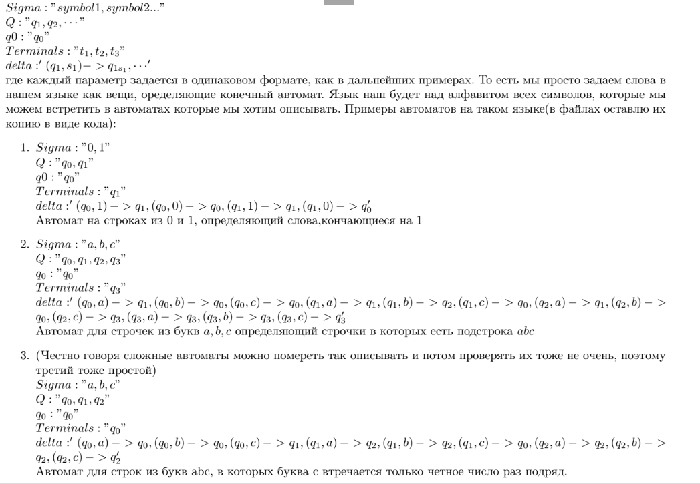
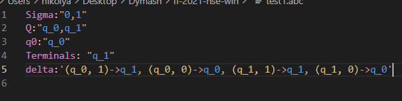
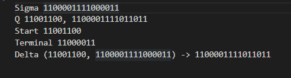
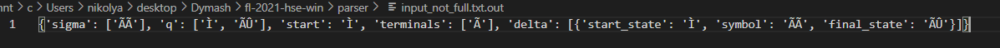
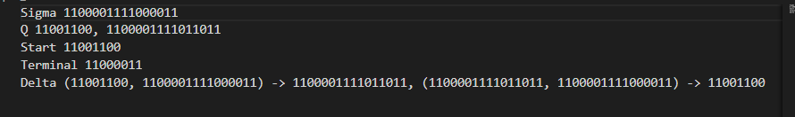

# Фидбек на языки описания автоматов
### Сергей Дымашевский
#### Язык
[гитхаб](https://github.com/DymashevskijSP/fl-2021-hse-win)

Язык выглядит очень простым и удобным для синтаксического анализа, благодаря 
явному перечислению всех символов алфавита, состояний (начальных и терминальных) и функций перехода.
Язык описан хорошо, я всё понял на примерах. 

#### Подсветка

Выглядит здорово, автор хорошо справился с выделелением смысловых частей языка: элементы конечного автомата
вершины, между которыми есть рёбра, выделены сами рёбра, кавычки, запятые, а также символы, по которым происходит переход. Единственное, что хочется изменить -- это 
одинаковый цвет для символов алфавита (тут в рёбрах они жёлтые, а в описании синие). 

#### Парсер
Пример описания неполного автомата: 

 Вывод :

Мысль заключается в том, что каждые 8 символов битовой строки задают какой-то символ `ASCII`, число в двоичной системе Сергей переводит в `char`.
В выводе программы хотелось бы увидеть побольше информации. Например, о том, что автомат неполный и почему, детерминированный ли или почему. Кроме того, такое задание автомата (в виде битовой строки) может нехило потрепать нервы, для алфавита длины 100
можно убиться выписывать все 1 и 0. Мне кажется, в такой системе гораздо удобнее тогда уж было бы записывать символы в десятичной или шестнадцатиричной системе и переводить в `char`. А ещё есть вопросы по выводу: почему в данном примере терминальное состояние не входит в множество всех состояний?
Кстати, в этом автомате есть ещё один недостаток: состояний может быть не больше 256, иначе придется добавлять биты и парсить уже по-другому, видимо. Про выводы других файлов в принципе вопросы аналогичные.

Пример корректного ввода:

Вывод:

`{'sigma': ['ÃÃ'], 'q': ['Ì', 'ÃÛ'], 'start': 'Ì', 'terminals': ['Ã'], 'delta': [{'start_state': 'Ì', 'symbol': 'ÃÃ', 'final_state': 'ÃÛ'}, {'start_state': 'ÃÛ', 'symbol': 'ÃÃ', 'final_state': 'Ì'}]}`