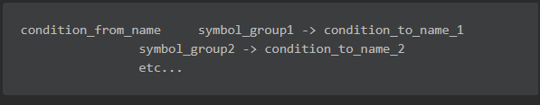
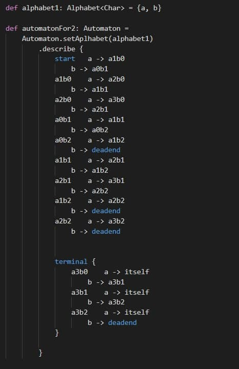
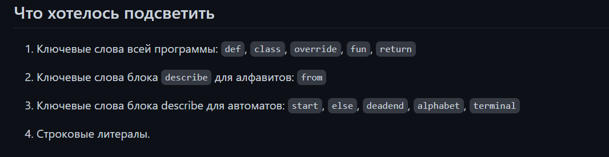

# Фидбек на языки описания автоматов
### Кирилл Креславский 
#### Язык
[гитхаб](https://github.com/KreslavskiKD/fl-2021-hse-win/)

В язык нужно вникать некоторое время, но его описание подробное и очень хорошо формализовано. Причем автомат строится на абсолютно произвольном алфавите благодаря идее
с наследованием от класса `Symbol` и методу inRange (или, как альтернатива, явное перечисление через `{}`). Кроме того, состояния и переходы задаются так, что их в целом удобно парсить:

#### Подсветка кода 

Кирилл подсвечивает следующие слова:

В целом подсветка хороша, но хочется, чтобы стрелочки и состояния тоже подсвечивались. Также можно было бы выделять как-то слово `alphabet`. 

#### Парсер
 Пока не реализован 