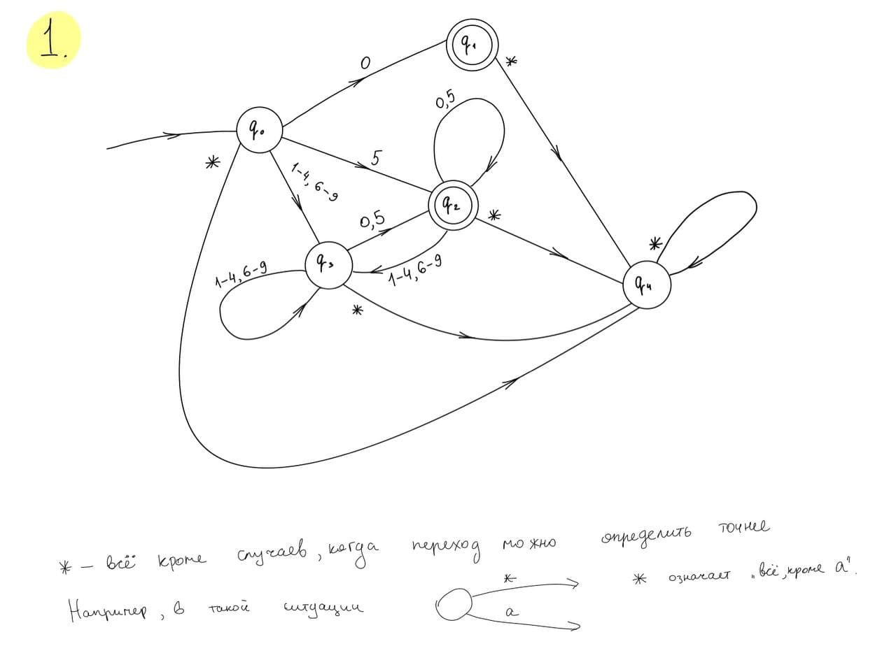
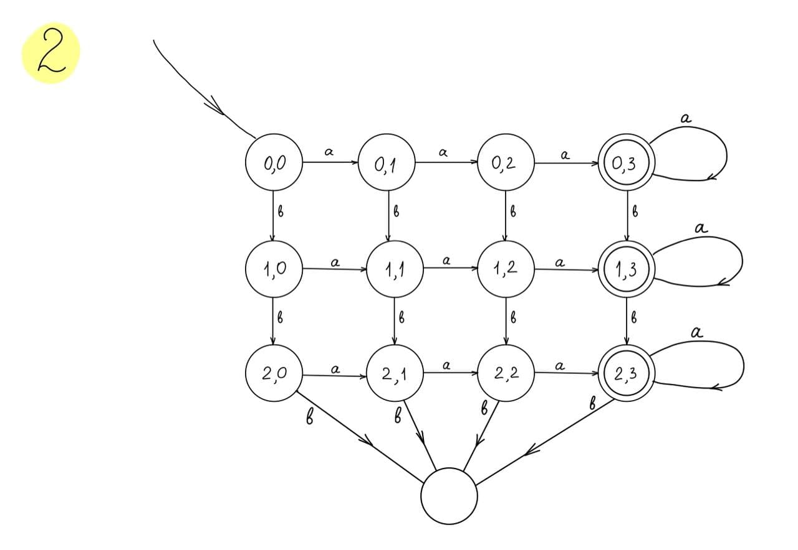

## Задание 1



## Задание 2



## Задание 3

В Котлине есть одна прикольная особенность
синтаксиса, о которой я до этого не слышал: `return at labels`.

Этот решает решает подобную проблему: предположим у нас ессть
некоторая функция, в которой мы используем некоторое лямбда выражение
и в какой-то момент хотим вызвать там `return`. Оказывается, что
тут наивное решение вернётся из всей функции, в которой мы вызывали лямбду.
Для того, чтобы избежать такого странного поведения, можно исаользовать 
специальный синтаксис, который указывает, из какой функции мы хотим сделать 
`return`. Он имеет вид `return@label`. [Ссылка на документацию Котлина](https://kotlinlang.org/docs/returns.html#return-at-labels).

## Задание 4

Сперва пользователю нашего языка предлагается обозначить свой автомат некоторым именем

`myDFA {...}`

Внутри фигурных скобок должно следовать описание автомата. У него должен быть следующий формат:

```javascript
{
    states {
        state1 *state description*,
        state2 *state description*,
        ...
        stateN *state description*
    }
    
    start {
        stateJ
    }
    
    transitions {
        *transition description*,
        *transition description*,
        ...
        *transition description*
    }
}
```

`stateI` -- это просто идентификаторы, которые пользователи задают состояниям самостоятельно, на своё усмотрение.

`states` должно содержать все состояния конечного автомата, а также их описание (формат которых будет приведён чуть ниже).

`start` должно содержать единственную строку: ID стартового состояния.

Что же такое `state description`? Это строка, которая содержит информацию о том, является ли состояние терминальным или нет. 
Описание может быть пустым. В таком случае состояние считается нетерминальным. Чтобы обозначить состояние терминальным,
необходимо использовать ключевое слово `terminal`. Пример объявления состояния: `q0 terminal`. 

Что такое `transition description`? Это строка, которая
состоит из следующих токенов: `ID1 --{symbols}--> ID2` (пробелы одинаковы),
где вместо
`symbols` нужно указать, при каких символах мы 
должны использовать данный переход. Пример описания перехода: `A --{a, b, c}--> B`.
Мы переходим из состояния `A` в состояние `B`, если видим символы `a`, `b` или `c`.

В файлах `example1.dfa`, `example2.dfa`, `example3.dfa` можно найти примеры описаний ращличных небольших автоматов на этом языке.
В `example1.dfa` можно видеть описание автомата из 1й задачи ДЗ. Во втором примере описан автомат, который принимает все
бинарные строки, которые начинаются с нуля. В третьем примере автомат принимает все бинарные строки, заканчивающиеся на 0.
