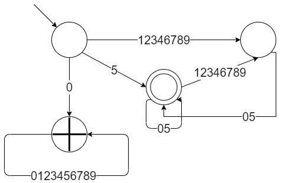
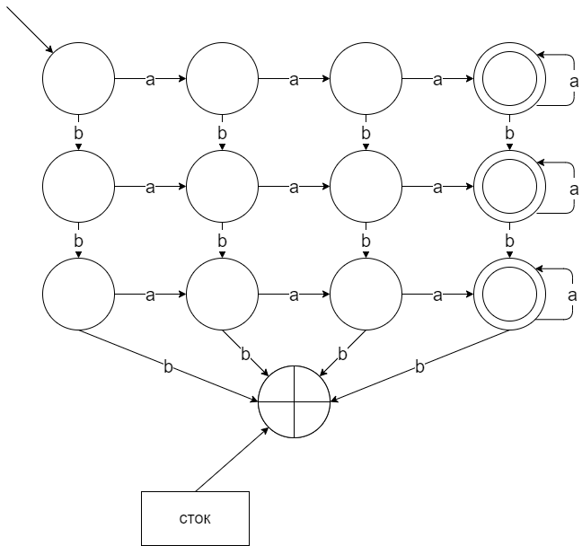
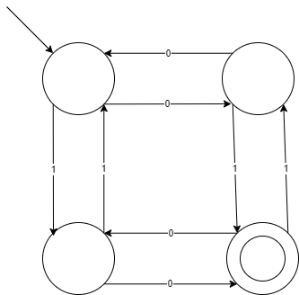
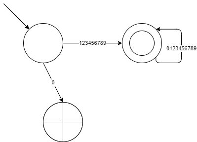

# Задание 1


# Задание 2


# Задание 3
Мой второй любимый язык программирования -- Python. Сегодня с радостью узнал (а может быть вспомнил) о существовании в нём, как и в C++, лямбда-выражений. [Тут](https://docs.python.org/3/tutorial/controlflow.html#lambda-expressions) ссылка на спецификацию. Вкратце можно писать так:
``` python
>>> def make_incrementor(n):
...     return lambda x: x + n
...
>>> f = make_incrementor(42)
>>> f(0)
42
>>> f(1)
43
```
По моему мнению очень классный способ избежать ненужного копирования кода. А вот так можно заполнять масcивы:
```python
>>> squares = list(map(lambda x: x**2, range(10)))
```
А еще из-за того, что в Pyton "всё--переменная" можно очень странно работать с методами классов (про это [тут](https://docs.python.org/3/tutorial/classes.html#method-objects)):
```python
Class Experiment:
    def f():
        return "Hello world"

Experiment x
xf=x.f
print(xf())
```
# Задание 4

Чтобы придумать язык нам понадобится алфавит. Алфавит: ```{s,t,q,d,1,2,3,4,5,6,7,8,9,:,->,___,,,(,)}```.

```s, t, q, d```--типы состояний (начальная, конечная, промежуточная, сток соответственно). 
Все состояния нумеруются натуральными числами подряд от 1. В начале нужно определить тип каждого состояния.
```___``` отделяет определение типов состояний. Например, определение состояний:
```
s:1
t:2
q:3,4,5
d:6
___
```
Переходы между состояниями происходят по условию. Условие пишется в скобках через запятую. Каждый новый переход пишется с новой строки. Например переход из состояния 1 в состояние 2 по символам ```6``` или ```7```:
```
(6,7):1->2
```
Теперь примеры. Вот так будет выглядит автомат для Задания 1 на моем языке:
```
s:1
t:2
q:3
d:4
___
(1,2,3,4,6,7,8,9):1->3
(0):1->4
(5):1->2
(0,5):2->2
(0,1,2,3,4,5,6,7,8,9):4->4
(1,2,3,4,5,6,7,8,9):2->3
(0,5):3->2
```
Распозновать слова с нечетным числом единиц и нечетным числом нулей:

```
s:1
t:3
q:2,4
___
(1):1->4
(1):4->1
(1):2->3
(1):3->2
(0):1->2
(0):2->1
(0):3->4
(0):4->3
```
Проверить число на натуральность:

```
s:1
t:2
d:3
___
(0):1->3
(1,2,3,4,5,6,7,8,9):1->2
(0,1,2,3,4,5,6,7,8,9):2->2
```

# Задание 5

## Функционал расширения xxxtension:

1. Подсветка ключевых слов
2. Подсветка однострочных комментариев
3. Подсветка численных литералов
4. Подсветка модификаторов
5. Подсветка строковых литералов в одинарных и двойных кавычках
