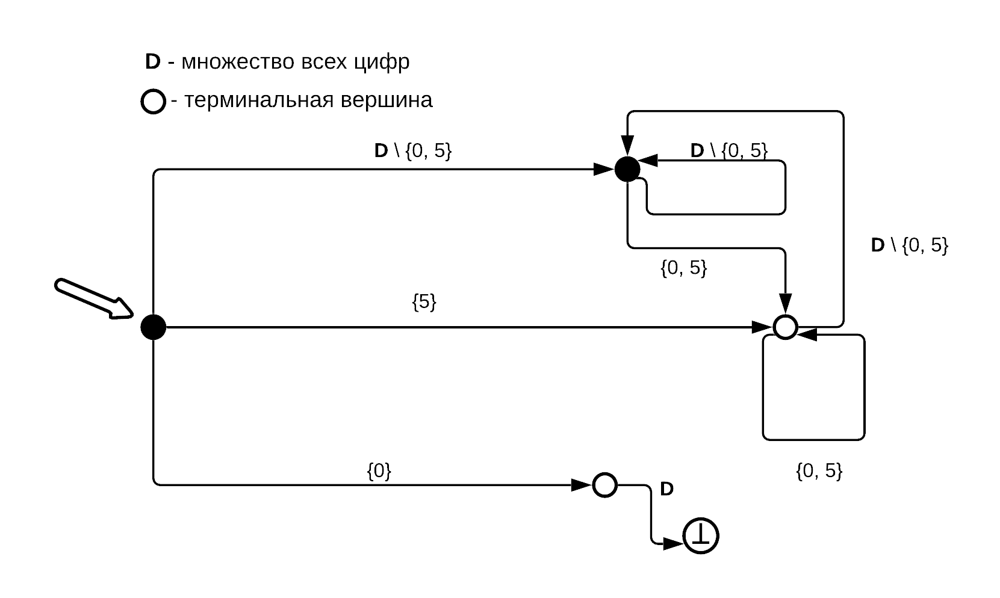
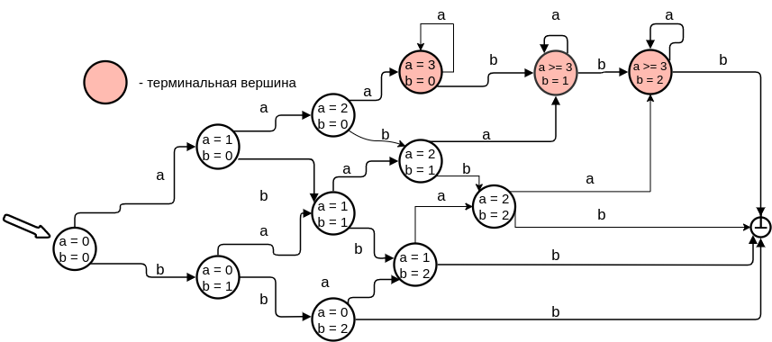
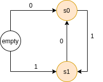
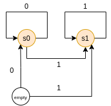
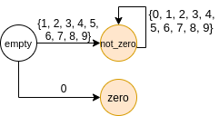
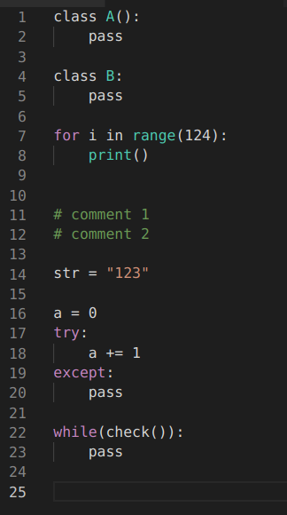

<b>
<center>Наумцев Антон</center>
<center>Домашняя работа</center>
<center>Второй курс | Первый модуль</center>
<center>Формальные языки # 1</center>             
</b>
<br/>
<br/>

<h5>Задание 1:</h5>



<h5>Задание 2:</h5>




<h5>Задание 3:</h5>
Выбранный язык: python

<a href="https://docs.python.org/3/reference/grammar.html">Python grammar specification</a>

1) <a href="https://www.python.org/dev/peps/pep-0465/" > Операторы @ и @= для перемножения матриц</a>
В python 3.5 были введены новые операторы: @=и @, выполняющие умножение матриц, чтобы различать * - поэлементное, @ - матричное произведения  
(! операторы определены только у numpy.array)
  
```python
import numpy

A = numpy.array([[1, 2], [3, 4]])    
B = numpy.array([[11, 12] ,[13, 14]])

print(A * B) 
# [[1 * 11,   2 * 12], 
#  [3 * 13,   4 * 14]]

print(A @ B) 
#  [[1 * 11 + 2 * 13,   1 * 12 + 2 * 14],
#   [3 * 11 + 4 * 13,   3 * 12 + 4 * 14]]
```
2) del-statement - должен быть выделен в отельную строку либо закрываться точкой с запятой:

```python
del_stmt:
         | 'del' del_targets &(';' | NEWLINE)

a = [1, 2]
del a[0], a[0] # так можно
del a[0], del a[0] # syntax error
del a[0]; del a[0] # зато так можно

# но при этом обе конструкции работают с функциями, не возвращающими значение
def f():
    print(1)
    
f(), f()
f(); f()

# ещё, как оказалось, в python если в объявлении функции не возвращается значение, то функция по дефолту будет возвращать None
```

3) else-блок можно использовать и после цикла for
оказывается else-block можно дописывать не толлько после if, while, except, но ещё и после for  
```python

for i in [1, 2, 3]:
	print(f'+{i}')
else:
	print(f'-TEST')
# +1 
# +2
# +3
# -TEST
```
<br/>
<br/>
<h5>Задание 4:</h5>
Самое главное в конечных автоматах - это описание состояний и переходов межд ними. А их лучше всего описывать при помощи ориентированного графа!
<br/>
Давайте позволим составителям конечных автоматов "руками" создавать состояния (вершины) и переходы (рёбра). <br/> 
```python

Alphabet: enum
# AlphabetElement: int == element of Alphabet

States: enum
# StateId: int == element of States 

Edges: enum
# EdgeId: int == element of Edges

q0: StateId # начальное состояние

class Node:
    id: StateId
    edges: list of EdgeId
    comment: string
    is_terminal: bool

class Edge:
    id: EdgeId
    allowed_letters: list of AlphabetElement # буквы, по которым можно пройти в следующую вершину
    begin: StateId
    end: StateId
    comment: string
```

По умолчанию будем считать, что алфавит нашего конечного автомата - это enum

Так как алфавит конечный, то мы до запуска программы можем проверить корректность составленного конечного автомата - надо проверить, что рёбра заданы корректно: то есть для одной буквы нет 2х разных направлений.

##### Как происходит описание конечного автомата?
1) описываем алфавит:
```python
Alphabet {
    d0,
    d1,
};
```
2) описываем множество состояний:
```python
States {
    s0,
    s1,
};
```
3) описываем множество рёбер
```python
Edges {
    empty_d0,
    empty_d1,
    s1_d0,
    s0_d1,
};
```
4) выставляем начальное состояние: 
```python
q0 = StateIds.empty
```

5) Описываем вершины и рёбра
...

#### Примеры:
1) Проверка чередования в строке из нулей и единиц

```python
# пример кода на описанном языке:
Alphabet {
    d0,
    d1,
};

States {
    empty,
    s0,
    s1,
};

Edges {
    empty_d0,
    empty_d1,
    s1_d0,
    s0_d1,
};

q0 = States.empty


new State(States.empty):
    edges: [empty_d0, empty_d1]
    comment: 'пустая строка'
    is_terminal: false

new State(States.s0):
    edges: [s0_d1]
    comment: 'текущий символ - 0'
    is_terminal: True

new State(States.s1):
    edges: [s1_d0]
    comment: 'текущий символ - 1'
    is_terminal: True

new Edge(Edges.empty_d0):
    allowed_letters: [d0] 
    begin: empty
    end: s0

new Edge(Edges.empty_d1):
    allowed_letters: [d1] 
    begin: empty
    end: s1 

new Edge(Edges.s1_d0):
    allowed_letters: [d0] 
    begin: s1
    end: s0

new Edge(Edges.s0_d1):
    allowed_letters: [d1] 
    begin: s0
    end: s1
```
2) Проверка того, что в строке сначала идут нули, а потом единицы
  
```python
# пример кода на описанном языке:
Alphabet {
    d0,
    d1,
};

States {
    empty,
    s0,
    s1,
};

Edges {
    empty_d0,
    empty_d1,
    s0_d0,
    s1_d1,
    s0_d1,
};

q0 = States.empty


new State(States.empty):
    edges: [empty_d0, empty_d1]
    comment: 'пустая строка'
    is_terminal: false

new State(States.s0):
    edges: [s0_d0, s0_d1]
    is_terminal: True

new State(States.s1):
    edges: [s1_d1]
    is_terminal: True

new Edge(Edges.empty_d0):
    allowed_letters: [d0] 
    begin: empty
    end: s0

new Edge(Edges.empty_d1):
    allowed_letters: [d1] 
    begin: empty
    end: s1 

new Edge(Edges.s0_d0):
    allowed_letters: [d0] 
    begin: s0
    end: s0

new Edge(Edges.s0_d1):
    allowed_letters: [d1] 
    begin: s0
    end: s1

new Edge(Edges.s1_d1):
    allowed_letters: [d1] 
    begin: s1
    end: s1
```

3) Проверка неотрицательных чисел на отсутствие лишних лидирующих нулей:

 

```python
# пример кода на описанном языке:
Alphabet {
    d0, d1, d2, d3, d4, d5, d6, d7, d8, d9
};

States {
    empty,
    zero,
    not_zero,
};

Edges {
    empty_not_zero,
    empty_zero,
    not_zero_not_zero
};

q0 = States.empty


new State(States.empty):
    edges: [empty_not_zero, empty_zero]
    comment: 'пустая строка'
    is_terminal: false

new State(States.zero):
    edges: []
    is_terminal: True

new State(States.not_zero):
    edges: [not_zero_not_zero]
    is_terminal: True


new Edge(Edges.empty_not_zero):
    allowed_letters: [d1,d2,d3,d4,d5,d6,d7,d8,d9] 
    begin: empty
    end: not_zero 

new Edge(Edges.empty_zero):
    allowed_letters: [d0] 
    begin: empty
    end: zero


new Edge(Edges.not_zero_not_zero):
    allowed_letters: [d0, d1,d2,d3,d4,d5,d6,d7,d8,d9]
    begin: not_zero_not_zero
    end: not_zero_not_zero
```
<br/>
<br/>
<h5>Задание 5:</h5>
 

### Отчёт:
Была добавлена подсветка:
1) ключевых слов: if, while, for, return, try, except
2) комментариев
3) строковых литералов
4) подсветка имени классов   


Запуск стандартный: F5 в папке naumtsev-ex
