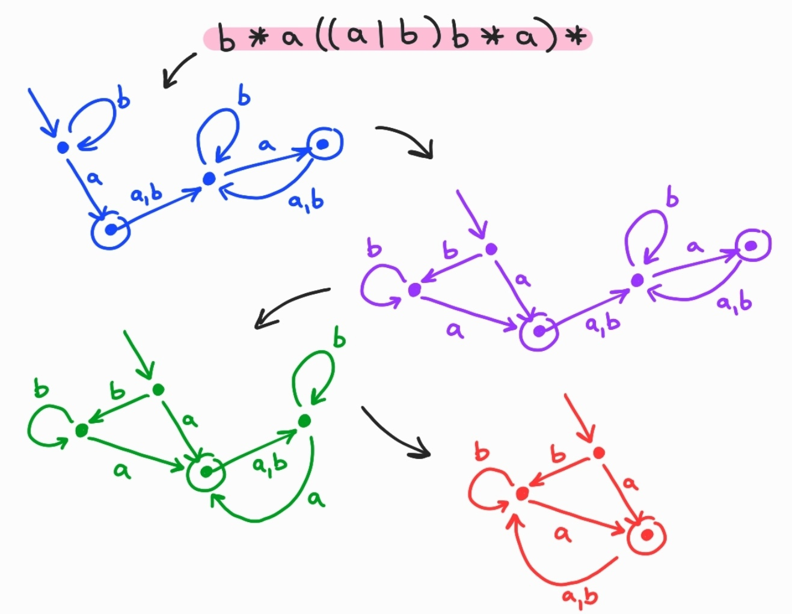
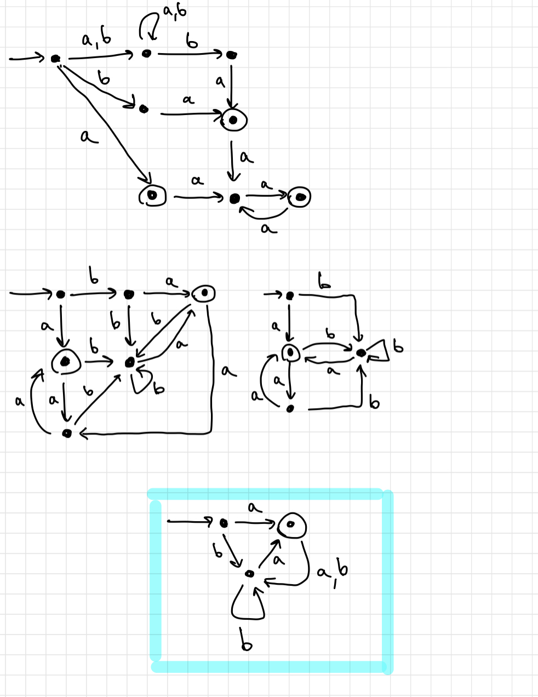

## 1 Задание
Давайте построим конечные автоматы и упростим их, чтобы было легче сравнивать

#### `b* a ((a | b) b* a)*`


#### `((a | b)* b a | a) (a a)*`


Как видим, после упрощения, конечные автоматы стали одинаковыми, а значит наши регулярные выражения над алфавитом `{a, b}` равны

## 2 Задание
Метки переходов, содержащие символы `char`, будем заключать в кавычки и экранировать символы `"` (`\"`) и `\` (`\\`). Тогда лексер сможет однозначно определить, когда перед ним специальный символ, а когда символьная последовательность (у которой будет токен `STR`)

К примеру:
```
2 \
1 - 0 \
2 - 1 \
3 - 3 \
1 -> 1 : "дед мороз", "\"", "\\" \
1 -> 2 : "северный" \
2 -> 2 : "дед мороз", "\"", "\\" \
2 -> 3 : "олень" \
3 -> 3 : "дед мороз", "\"", "\\" \

- \ -> : ,    -    cпециальные символы

"дед мороз"
"\""
"\\"          -    символьные последовательности
"северный"
"олень" 
```

## 3 Задание
Лексер реализован на языке `python3` и находится в файле `lex.py`. Используется генератор лексеров `psy.lex`. 

Запускается при помощи `python3 lex.py "input"`, где `input` - входной файл. (может быть не `python3`, например локально у меня `python3.9`, так как стоит несколько версий). Результат работы записывается в `input.out`

Приведены тесты `input1`, `input2`, `input3`, `input4` и их результаты в файлах с расширением `.out` соответственно