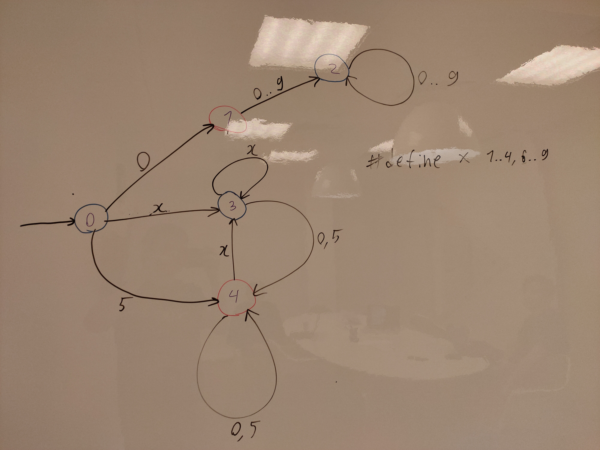
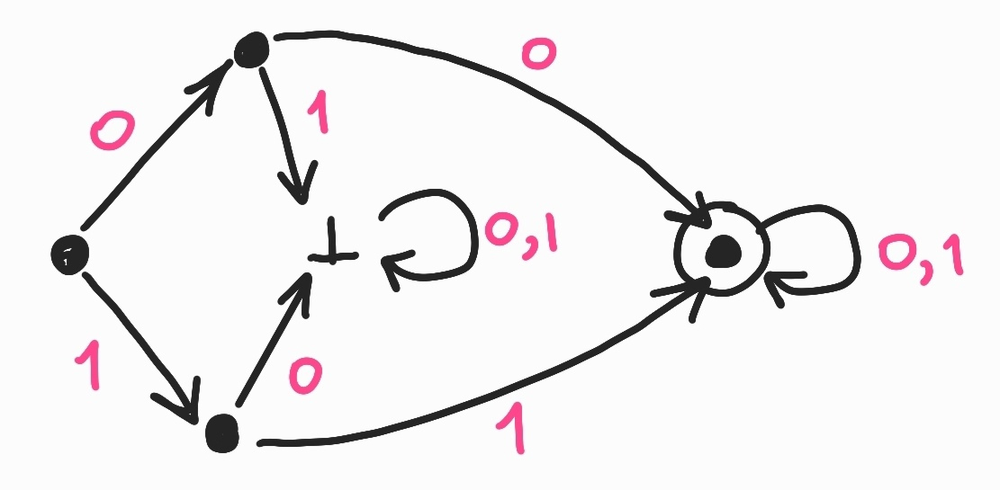

# Задание 1
Построить полный конечный детерминированный автомат, распознающий язык неотрицательных чисел без лидирующих нулей, делящихся на 5.



# Задание 2
Построить полный конечный детерминированный автомат, распознающий язык строк над алфавитом `{a, b}`, в которых букв `a` не меньше 3, а букв `b` не больше 2.



# Задание 3
Найти документацию вашего второго самого любимого языка программирования. Найти особенности лексического синтаксиса, о которых вы раньше не знали. В отчете описать особенности и привести ссылку на спецификацию.

Я нашел несколько особенностей лексического синтаксиса языка Python

### [Явное объединение строк](https://ru.wikibooks.org/wiki/Python/%D0%A1%D0%BF%D1%80%D0%B0%D0%B2%D0%BE%D1%87%D0%BD%D0%B8%D0%BA_%D0%BF%D0%BE_%D1%8F%D0%B7%D1%8B%D0%BA%D1%83_Python_3.1#2.1.5._%D0%AF%D0%B2%D0%BD%D0%BE%D0%B5_%D0%BE%D0%B1%D1%8A%D0%B5%D0%B4%D0%B8%D0%BD%D0%B5%D0%BD%D0%B8%D0%B5_%D1%81%D1%82%D1%80%D0%BE%D0%BA)
```python
if 1900 < year < 2100 and 1 <= month <= 12 \
    and 1 <= day <= 31 and 0 <= hour < 24 \
    and 0 <= minute < 60 and 0 <= second < 60:
         return 1
```
Две или несколько [физических строк](https://ru.wikibooks.org/wiki/Python/%D0%A1%D0%BF%D1%80%D0%B0%D0%B2%D0%BE%D1%87%D0%BD%D0%B8%D0%BA_%D0%BF%D0%BE_%D1%8F%D0%B7%D1%8B%D0%BA%D1%83_Python_3.1#%D0%A4%D0%B8%D0%B7%D0%B8%D1%87%D0%B5%D1%81%D0%BA%D0%B8%D0%B5_%D1%81%D1%82%D1%80%D0%BE%D0%BA%D0%B8) могут быть объединены в одну [условную](https://ru.wikibooks.org/wiki/Python/%D0%A1%D0%BF%D1%80%D0%B0%D0%B2%D0%BE%D1%87%D0%BD%D0%B8%D0%BA_%D0%BF%D0%BE_%D1%8F%D0%B7%D1%8B%D0%BA%D1%83_Python_3.1#%D0%9B%D0%BE%D0%B3%D0%B8%D1%87%D0%B5%D1%81%D0%BA%D0%B8%D0%B5_%D1%81%D1%82%D1%80%D0%BE%D0%BA%D0%B8) при помощи символа `\` (бэкслэш). 

Строка, оканчивающая бэкслэшем не может содержать комментарий

### [Неявное объединение строк](https://ru.wikibooks.org/wiki/Python/%D0%A1%D0%BF%D1%80%D0%B0%D0%B2%D0%BE%D1%87%D0%BD%D0%B8%D0%BA_%D0%BF%D0%BE_%D1%8F%D0%B7%D1%8B%D0%BA%D1%83_Python_3.1#2.1.6._%D0%9D%D0%B5%D1%8F%D0%B2%D0%BD%D0%BE%D0%B5_%D0%BE%D0%B1%D1%8A%D0%B5%D0%B4%D0%B8%D0%BD%D0%B5%D0%BD%D0%B8%D0%B5_%D1%81%D1%82%D1%80%D0%BE%D0%BA)
```python
month_names = ['Januari', 'Februari', 'Maart',      # Это
                'April',   'Mei',      'Juni',       # голландские
                'Juli',    'Augustus', 'September',  # названия
                'Oktober', 'November', 'December']   # месяцев
```
Выражения в круглых, квадратных или фигурных скобках могут быть разделены на несколько физических строк без использования `\`. Они также могут содержать комментарии

### [Запись дробных чисел (с плавающей запятой)](https://ru.wikibooks.org/wiki/Python/%D0%A1%D0%BF%D1%80%D0%B0%D0%B2%D0%BE%D1%87%D0%BD%D0%B8%D0%BA_%D0%BF%D0%BE_%D1%8F%D0%B7%D1%8B%D0%BA%D1%83_Python_3.1#2.4.5._%D0%97%D0%B0%D0%BF%D0%B8%D1%81%D1%8C_%D0%B4%D1%80%D0%BE%D0%B1%D0%BD%D1%8B%D1%85_%D1%87%D0%B8%D1%81%D0%B5%D0%BB_(%D1%81_%D0%BF%D0%BB%D0%B0%D0%B2%D0%B0%D1%8E%D1%89%D0%B5%D0%B9_%D0%B7%D0%B0%D0%BF%D1%8F%D1%82%D0%BE%D0%B9))
Лексическое определение:
```
floatnumber   ::=  pointfloat | exponentfloat
pointfloat    ::=  [intpart] fraction | intpart "."
exponentfloat ::=  (intpart | pointfloat) exponent
intpart       ::=  digit+
fraction      ::=  "." digit+
exponent      ::=  ("e" | "E") ["+" | "-"] digit+
```
Примеры дробных чисел
```python
3.14
10.
1e100
3.14e-10
```

### [Запись мнимых чисел](https://ru.wikibooks.org/wiki/Python/%D0%A1%D0%BF%D1%80%D0%B0%D0%B2%D0%BE%D1%87%D0%BD%D0%B8%D0%BA_%D0%BF%D0%BE_%D1%8F%D0%B7%D1%8B%D0%BA%D1%83_Python_3.1#2.4.6._%D0%97%D0%B0%D0%BF%D0%B8%D1%81%D1%8C_%D0%BC%D0%BD%D0%B8%D0%BC%D1%8B%D1%85_%D1%87%D0%B8%D1%81%D0%B5%D0%BB)
Лексическое определение:
```
imagnumber ::=  (floatnumber | intpart) ("j" | "J")
```
Под мнимое число отводится комплексное число с действительной частью `0`. Чтобы создать комплексное число с ненулевой действительной частью, нужно сложить обычное дробное число с мнимым числом, например `(3 + 4j)`

Примеры мнимых чисел
```python
3.14j
10.j
1e100j
3.14e-10j
```

# Задание 4
Придумать язык для описания конечных автоматов. Привести описание этого языка на естественном языке. Привести три файла, описывающих какие-нибудь автоматы на вашем языке.

# Задание 5
Подсветить какие-нибудь особенности лексического синтаксиса в среде разработки. В отчете указать, что вы хотели подсветить и как.