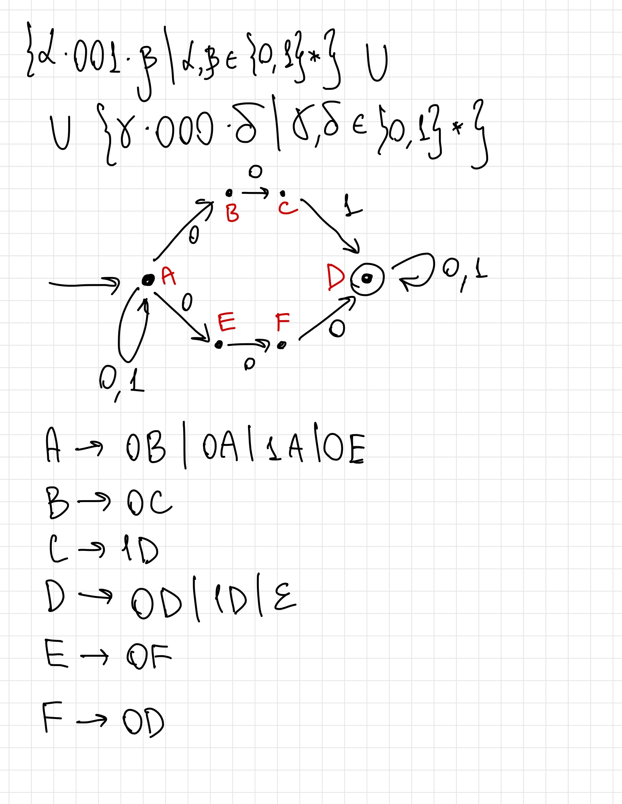
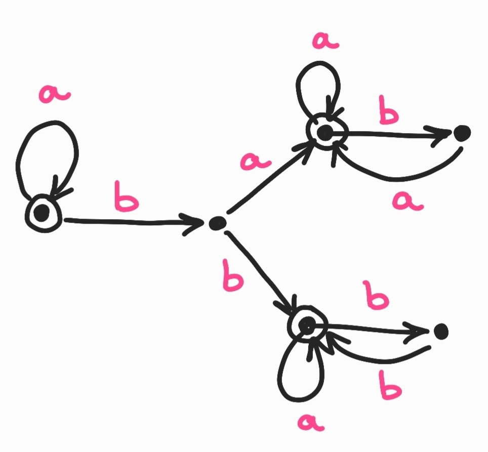

# Задание 1
#### 4)$(a \mid b) ((a \mid b) b)^* (a \mid b) $
Три самых коротких строки:
- `aa`
- `ab`
- `ba`

Принадлежат ли `abbab` и `bababa` данному языку? 
- `abbab` - нет
- `bababa` - да

# Задание 2
#### 4)$\{ a \cdot \omega \cdot b \mid \omega \in \{0, 1\}^*, a \in \{0, 1\}, b \in \{0, 1\}, a \ and \ b = 0 \}$

# Задание 3 
#### 4)$\{ \alpha \cdot 001 \cdot \beta \mid \alpha, \beta \in \{0, 1\}^*\} \cup \{\gamma \cdot 000 \cdot \delta \mid \gamma, \delta \in \{0, 1\}^* \}$

Для начала построим НКА, а потом по нему построим регулярную грамматику (как в презентации)

# Задание 4
#### 4)$\{\omega \in \{a, b\}^* \mid |\omega|_a \neq |\omega|_b\}$

Этот язык не является регулярным. Воспользуемся леммой о накачке

Пусть $w = a^n b^{n! + n}$

$x = a^m, m \geq 0$ 

$y = a^l, l > 0$

$l + m \leq n$

$z = a^i b^{n! + n}$

Докажем что для $\forall l \ \exists k \geq 0$, что $xy^kz \notin L$ (то есть $|w_a| = |w_b|$)

$n! + n = (k - 1)l + m + i$

$n! + n = (k - 2)l + n$

$k = 2 + \frac{n!}{l}$

Но так как $0 < l \leq n$, то $n!$ делится на $l$ и такое $k$ всегда существует. Значит наш язык не регулярный

# Задание 5
#### 4)$(a \mid b) ((a \mid b) b)^* (a \mid b) $

