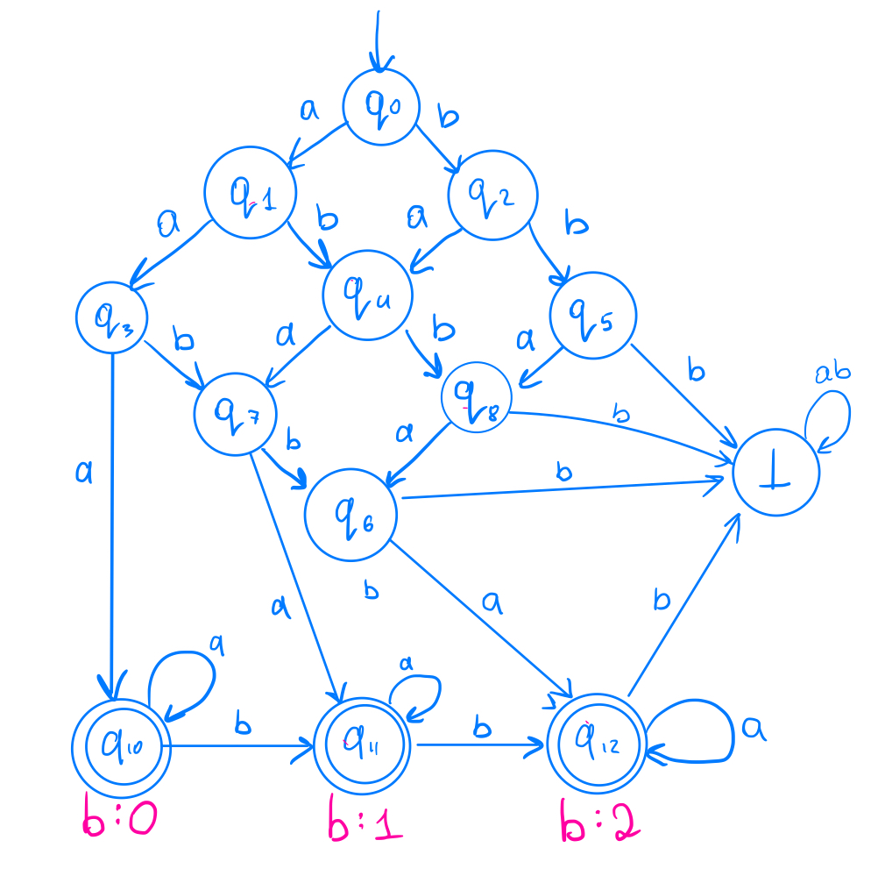
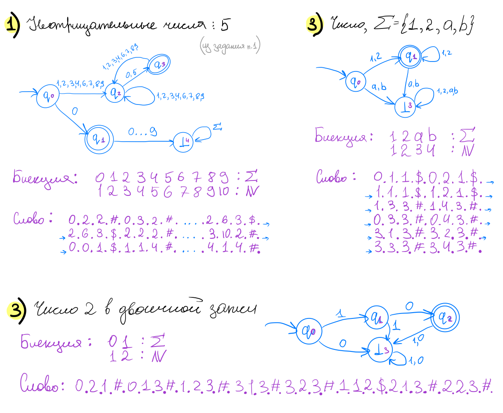
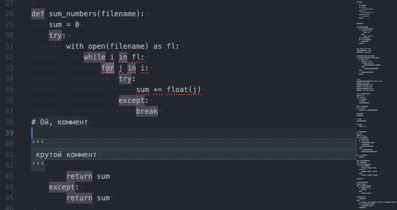

# Задание 1

#### Построить полный конечный детерминированный автомат, распознающий язык неотрицательных чисел без лидирующих нулей, делящихся на 5.

  Решение:  Полученный граф имеет 5 состояний.

# Задание 2

#### Построить полный конечный детерминированный автомат, распознающий язык строк над алфавитом `{a, b}`, в которых букв `a` не меньше 3, а букв `b` не больше 2.

  Решение:  Полученный граф имеет 13 состояний.

# Задание 3

#### Найти документацию вашего второго самого любимого языка программирования. Найти особенности лексического синтаксиса, о которых вы раньше не знали. В отчете описать особенности и привести ссылку на спецификацию.

  Я знаю на данный момент 3 языка программирования, каждый из них мы успели пройти в первом курсе. Cpp, Python, Bash. В отчете я опишу особенности лексического синтаксиса языка Python. Документацию по нему можно найти [тут](https://docs.python.org/3/).

  **1) Dictionary Merge**
    В языке Python есть оператор, который позволяет сливать два словаря.

    ```python
    >>> x = {"key1": "value1 from x", "key2": "value2 from x"}
    >>> y = {"key2": "value2 from y", "key3": "value3 from y"}
    >>> x | y
    {'key1': 'value1 from x', 'key2': 'value2 from y', 'key3': 'value3 from y'}
    >>> y | x
    {'key2': 'value2 from x', 'key3': 'value3 from y', 'key1': 'value1 from x'}
    ```

  **2) Pattern Matching**
    [Match-case](https://www.python.org/dev/peps/pep-0636/), похож на switch-case в других языках.

    ```python
    match command.split():
    case ["quit"]:
        print("Goodbye!")
        quit_game()
    case ["look"]:
        current_room.describe()
    case ["get", obj]:
        character.get(obj, current_room)
    case ["go", direction]:
        current_room = current_room.neighbor(direction)
    ```


    **3) All, any**
      Функция any возвращает значение True, если хотя бы одно из переданных утверждений верно, all – в случае, если все верны. На мой взгляд, эти две функции заслуживают отдельного внимания всего лишь из-за их простоты в использовании.

    ```python
    >>> print(all([2 == 2, 3 == 2]))
    False
    >>> print(all([2 > 1, 3 != 4]))
    True
    >>> print(any([True, False, False]))
    True
    >>> print(any([False, False]))
    False
    ```


    **4) Моржовый оператор (Walrus Operator)**
      Присваивания с помощью моржа требуется делать в круглых скобках, и перед знаком равно пишется двоеточие. Внутри скобок либо создается новая переменная, либо происходит присвоение значения уже существующий переменной. Но фишка заключается в том, что вся эта конструкция, скажем так, возвращает присвоенное значение, как это делают обычные функции.

      ```python
      # так нам не нужно писать для присваивания лишнюю строчку
      if (n := len(a)) > 10:
        print(f'Слишком много элементов, а именно {n}')
      ```

    **5) Корутины (Coroutines)**
      В PEP 342 были представлены [корутины](https://docs.python.org/3/library/asyncio-task.html), которые стали некой противоположностью генераторов.

    ```python
    >>> def double():
    ...     print('> Начало функции')
    ...     value = 2 * (yield)
    ...     print('> value = {}'.format(value))
    ...     yield value
    ...     print('> Конец функции')
    >>> d = double()
    >>> next(d)
    > Начало функции
    >>> d.send(21)  # метод send объекта генератора передает данные в функцию
    > value = 42
    42
    >>> d.send(42)
    > Конец функции
    Traceback (most recent call last):
      File "<stdin>", line 1, in <module>
    StopIteration
    ```

# Задание 4

#### Придумать язык для описания конечных автоматов. Привести описание этого языка на естественном языке. Привести три файла, описывающих какие-нибудь автоматы на вашем языке.

  Пусть автомат - это ориентированный граф. И в нашем языке словом будет граф. Теперь нужно придумать, как закодировать граф в слово. Скажем, что в слове содержится описание каждого ребра. Пусть слово состоит из 4 сущностей (будем также ставить точку в конце каждой сущности):

-   `Число`, отвечающее за вершину, из которой выходит ребро.
-   `Число`, отвечающее за то, по чему мы совершаем переход. То есть в КДА на ребра записано что-то из алфавита. Поскольку алфавит это конечное множество, то мы можем составить биекцию между префиксом ряда натуральных чисел и алфавитом. Таким образом мы можем заранее знать, как именно выглядит эта вторая сущность в нашем алфавите для описания КДА. (Очевидно, что если переход осуществляется по нескольким символам алфавита КДА, то мы просто описываем несколько ребер с одинаковым in и out, но разной второй сущностью)
-   `Число`, отвечающее за вершину, в которую выходит ребро.
-   `$` - если это состояние терминальное и `#` в обратном случае.

    Приведем несколько автоматов, которые опишем новым языком: 

# Задание 5

#### Подсветить какие-нибудь особенности лексического синтаксиса в среде разработки. В отчете указать, что вы хотели подсветить и как.

  Я решила сделать подсветку синтаксиса языка python для среды разработки Atom на MacOS. После несколький часов поиска шаблона, я нашла специальный пакет, который позволяет выделять заданные слова в зависимости от расширения файла. [Базовый пакет можно скачать тут.](https://github.com/BlueSilverCat/highlight-registered-keyword)
  В первую очердь нужно было создать [CSON file](sample-config.cson) и прописать путь к нему в настройках пакета. В этом файле хранятся данные о ключевых словах. Далее нужно было создать [styles.less file](highlight-registered-keyword-), куда можно было записать, каким цветом будут выделяться ключеные слова из первого файлика.
  Таким образом получился данный результат: 
