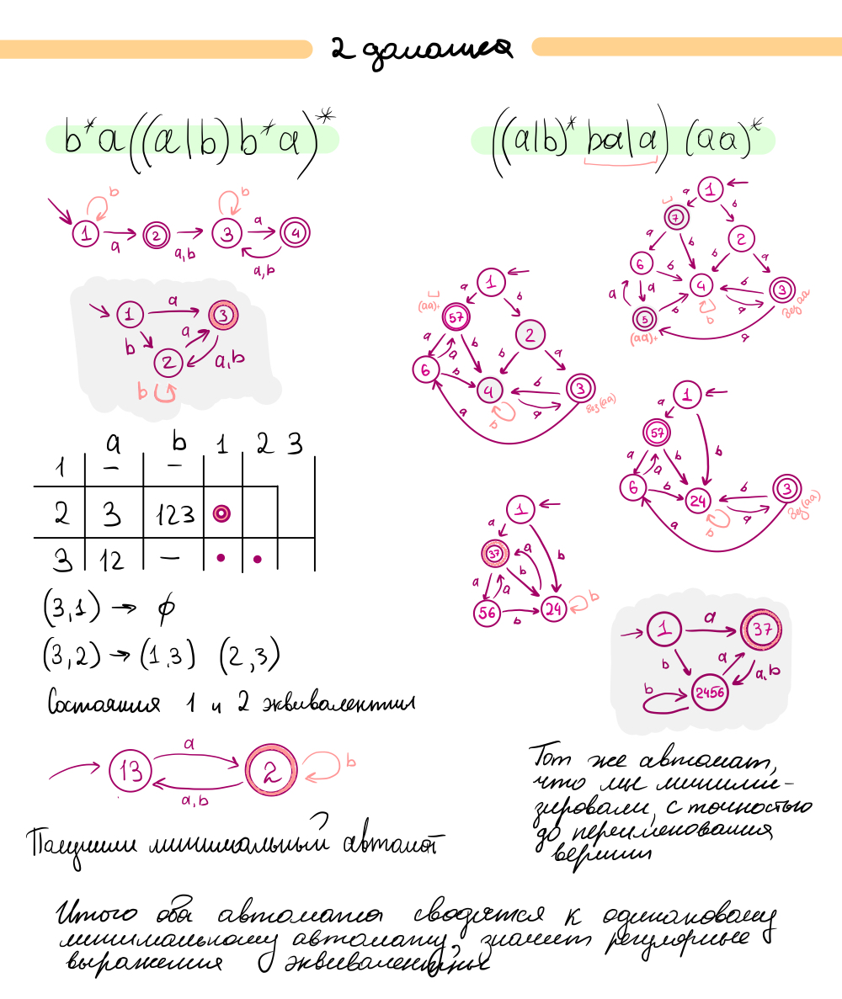

# Задание 1

####  Равны ли данные регулярные выражения над алфавитом `{a, b}`? Обосновать. Можно построить минимальные детерминированные конечные автоматы и сравнить их. Альтернативно можно доказать, что любая строка, задаваемая первым регулярным выражением, принадлежит языку второго регулярного выражения и наоборот (или привести контрпример). (2 балла)
####  a. `b* a ((a | b) b* a)*`
####  b. `((a | b)* b a | a) (a a)*`

Для того, чтобы понять, равны ли данные регулярные выражения, нарисуем конечные детерминированные автоматы для каждого из них. Далее минимизируем. Если они окажутся равны, то равны и регклярные выражения. Все шаги описаны ниже.

# Задание 2

#### Улучшить язык описания конечных автоматов из предыдущего домашнего задания таким образом, чтобы символами алфавита автомата могли быть произвольные последовательности символьного типа `char`. То есть если у вас в языке есть ключевые слова или специальные операторы (например, `,` в качестве разделителя или `-->` для обозначения перехода), должна быть возможность использовать их как метки переходов автомата. (2 балла)

В моем языке в начале написаны символы автомата и биекция их в натуральные числа. К счастью, символы, по которым осуществляется переход, обязательно заключены в кавычки. По этой причине я точно могу сказать, специальный это символ или символ алфавита входного автомата. Единственная проблема может быть в том, что символом алфавита автомата будет `"`. Ничего страшного, просто экранируем при помощи `\`. Если в алфавите автомата оказался `\` его тоже экранируем. В общем-то получился такой же алгоритм как в языке Си.

# Задание 3

#### Реализовать лексер при помощи генератора лексеров (например, семейства lex) для вашего языка описания конечных автоматов. (4 балла)
  * __Можно писать на любом языке__
   * Мной был использован язык python.
  * __Можно использовать любой генератор лексеров.__
   * И генератор лексеров `ply.lex`.
  * __Задание должно быть оформлено как консольное приложение, принимающее как аргумент командной строки путь ко входному файлу. Результат лексического анализа должен быть записан в файл с тем же именем, но добавочным расширением `.out` (если вход -- `input.txt`, то результат работы записать в `input.txt.out`).__
    * Код представлен в файле `My-lex.py`. В файле `My-DFA` лежит пример автомата. Лексер запускается строчкой `python3.7  My-lex.py "My-DFA"` в консоли. Вывод же программы осуществляется по правилам в задании. Пример в файле `My-DFA.out`.
  * __Каждый токен должен содержать тип, значение и координаты во входном файле.__
    * Выполнено
  * __Если вход лексически некорректен, сообщить об ошибке цивилизованно: исключениями в пользователя бросать не стоит.__
    * Выполнено
  * __Обязательно привести тесты для вашего лексера.__
    * Выполнено
