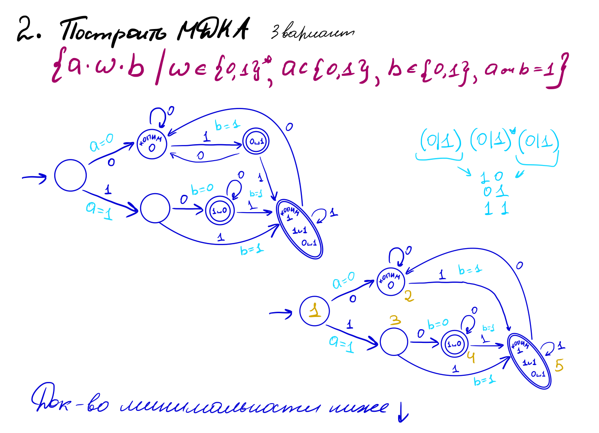
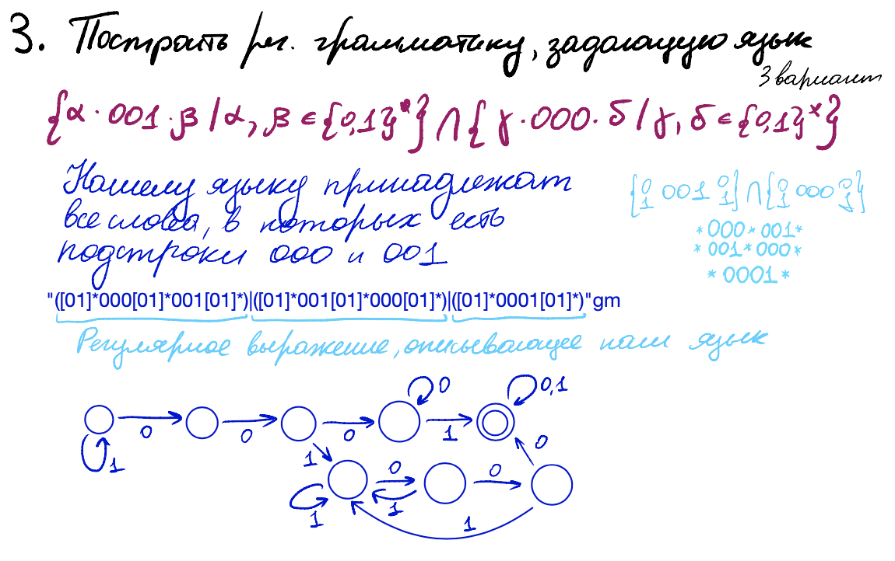
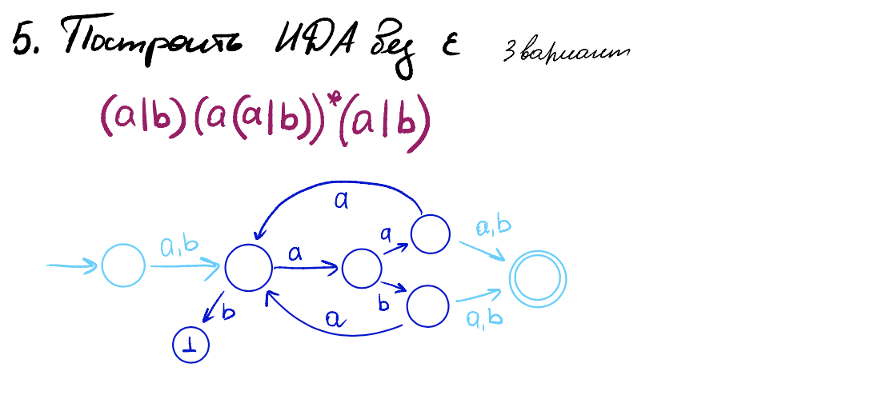

# Задание 1


# Задание 2


Понятно, что нам нужно различать состояния, где мы копим нолики и где мы копим единички, потому что в противном случае мы никогда не сможем выйти из этой вершинки (две петли по всем возможным буквам).  => **5 != 4; 5!= 2** <br />
Если мы от первой не сделаем два перехода в другие вершинки (к примеру, не накрутим петлю), то не сможем отследить, чему была равна `a`.  => **2 != 3; 1 !=2; 1!=3** <br />
Копить нолики мы можем в конце, когда набрали а=1 или в начале, когда есть вероятность последней единички  => **2 != 4** <br />
**3 != 4** так как после переходы по единичке мы пока не можем быть терминалом - слова длины один просто нет в нашем языке. По той же причине **5 != 3** <br />
Так мы получили минимальный детерминированный конечный автомат для данного языка


# Задание 3



вот регулярочка:
```java
"([01]*000[01]*001[01]*)|([01]*001[01]*000[01]*)|([01]*0001[01]*)"gm
```

# Задание 4


# Задание 5


