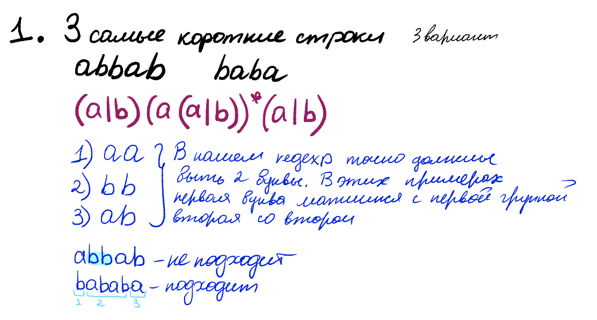
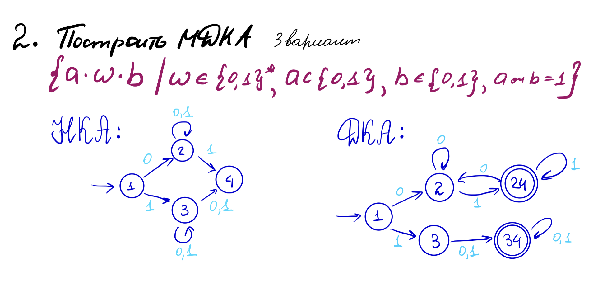
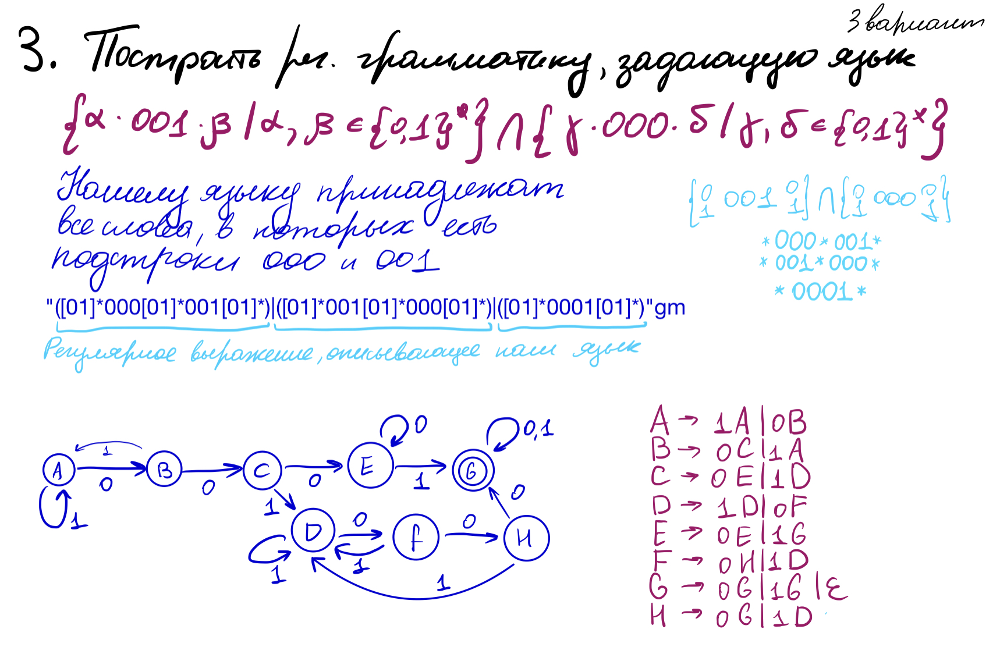
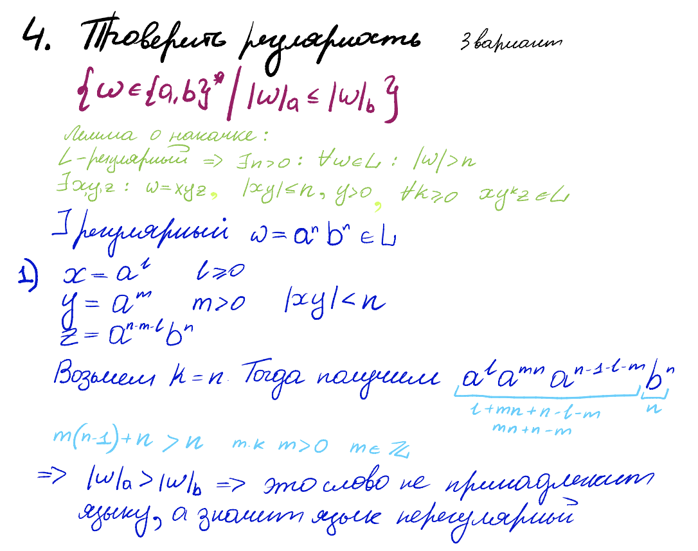
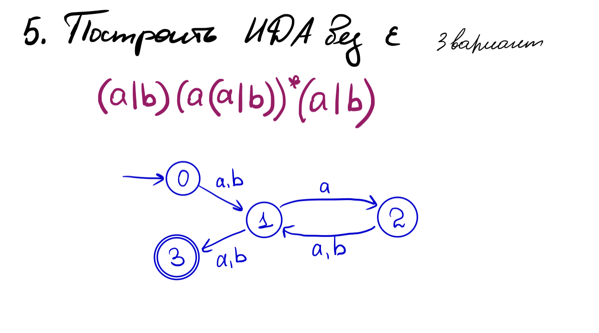

# Задание 1



# Задание 2


**Доказательство минимальности:**
Понятно, что нам нужно различать состояния, где  `a=1` и `a=0`, так как тогда мы не сможем отследить, можно или нельзя иметь `b=0`. Два терминальных состояния тоже не могут быть объединены, так как в нижнее можно зайти по единичке, а в верхнее нельзя. Итого наш автомат из пяти состояний минимален.

# Задание 3



вот регулярочка:

```java
"([01]*000[01]*001[01]*)|([01]*001[01]*000[01]*)|([01]*0001[01]*)"gm
```

# Задание 4



# Задание 5


