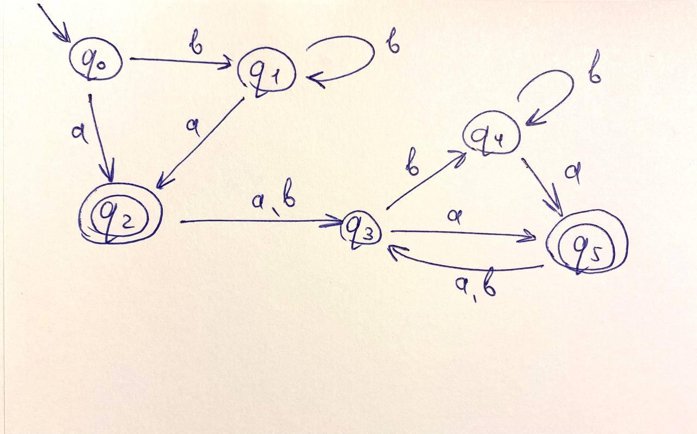
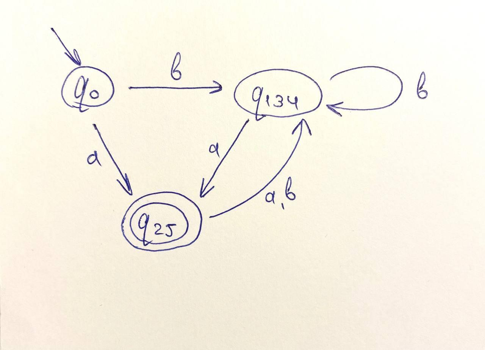
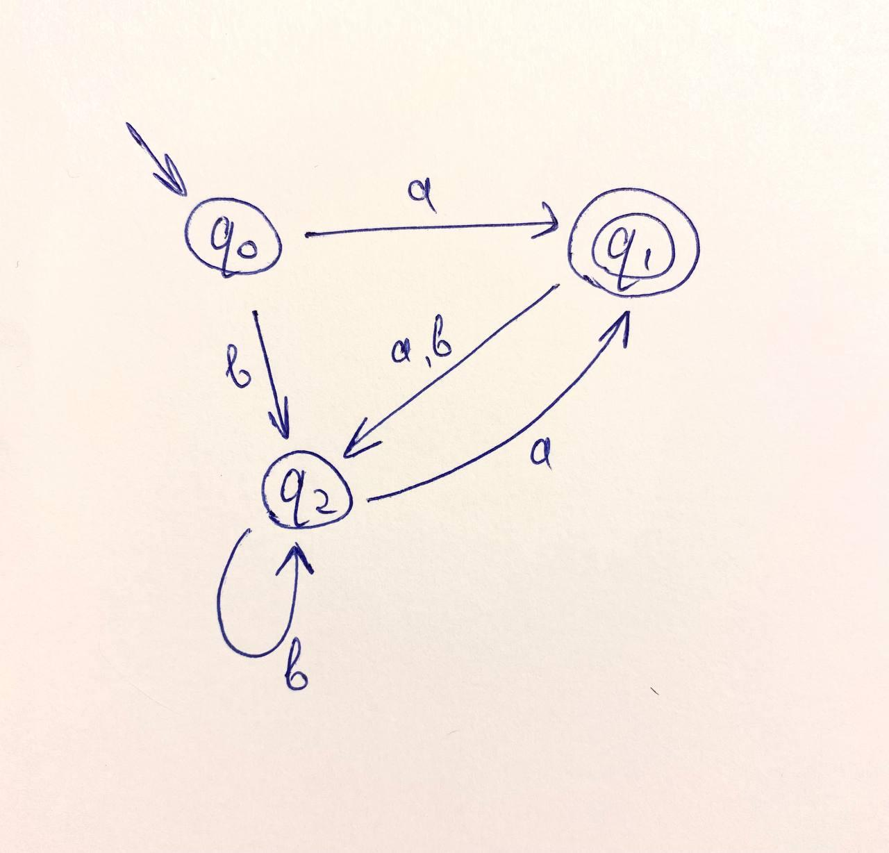

Для того, чтобы понять, равны ли данные регулярные выражения, построим к каждому из них минимальные ДКА и сравним их.  

a) b* a ((a | b) b* a)*   
Изначально у меня получился такой автомат:
  

Далее проделав алгоритм минимизации автомата (как на практике), у меня получился следующий результат:
  

b) ((a | b)* b a | a) (a a)*   
Полученный автомат:

Заметим, что данные автоматы изоморфны, даже равны. В них всего 3 состояния, между которыми одинаковые функции перехода. Значит, данные регулярные выражения равны. 
