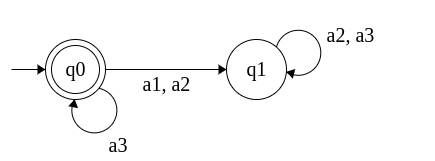
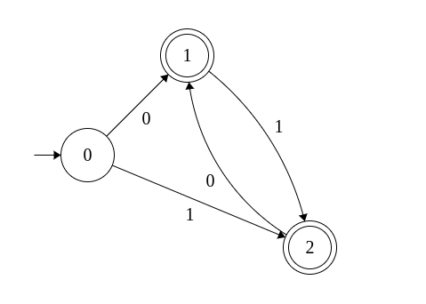
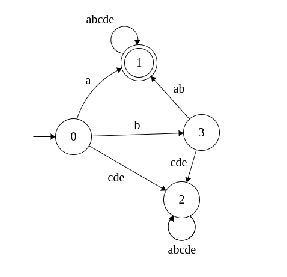

### Придумать язык для описания конечных автоматов. Привести описание этого языка на естественном языке. Привести три файла, описывающих какие-нибудь автоматы на вашем языке.

Оформление:
```cpp
// Все символы содержатся в двойных кавычках и перечисляются через пробел
// Имена символов и состояний могут содержать только латинские буквы и цифры
"a1 a2 a3 a5 a6 a7 a8"
// Терминальное состояние q  обозначается
(q)
// начальное состояние q. Оно может быть только одно, поэтому однозначно сопоставим ему символ
@
// Алфавит задается ключевым словом Sigma
Sigma "a1 a2 a3 a5 a6 a7 a8"
// Переходы перечисляются построчно и оформляются так:
/* первое состояние->(символы, по которым можно перейти во второе состояние, перечисление пробел)-> второе состояние */
@->"a1 a2"->(q2) // переход из начальной вершины в терминальную
q1->"a7 a8"->q1
```
### Примеры
Есть автоматы, заданные графами:


На моем языке:
```cpp
Sigma "a1 a2 a3" // Алфавит
(@)->"a3"->(@)
(@)->"a1 a2"->q1
q1->"a2 a3 a1"->q1

```


```cpp
Sigma "0 1" // Алфавит
@->"0"->(1)
@->"1"->(2)
(1)->"1"->(2)
(2)->"0"->(1)
```


```cpp
Sigma "a b c d e" // Алфавит
@->"a"->(1) // Ребро из начальной вершины в терминальную
@->"b"->3
@->"c d e"->2
(1)->"a b c d e"->(1)
3->"a b"->(1)
3->"c d e"->2
2->"a b c d e"->2
```

- Можно задать пустую строку как `""`


