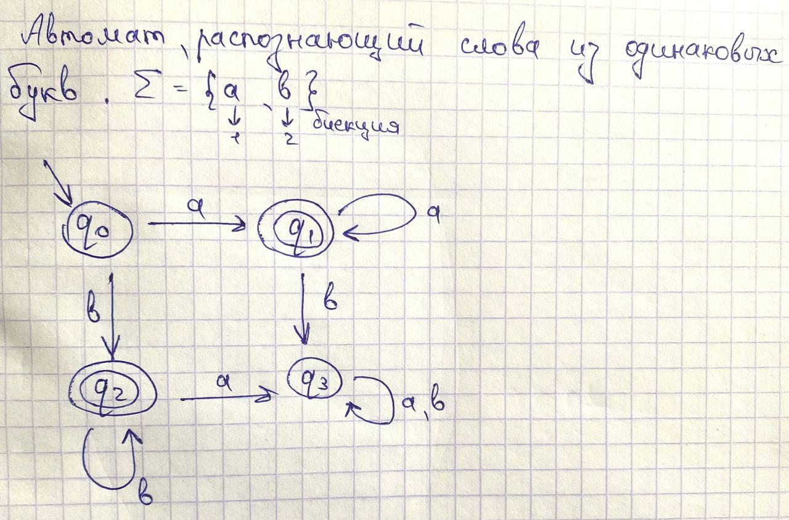

# Исправления
Немного изменим алгоритм, которым будет описываться автомат.
Каждое число оборачиватся в "(..)". Описание автомата:
1) Количество состояний в автомате
2) Номер вершины - стартового состояния
3) Kоличество терминальных состояний, далее перечисление их номеров
4) Количество ребер, далее описание всех ребер автомата по принципу: (номер состояния - начала ребра)(номер состояния - конца ребра)(описание функции перехода по этому ребру)
Описание функции перехода по ребру остается прежним: мы строим биекцию между алфавитом языка автомата и натуральными числами и просто кодируем числами все символы языка автомата, по которым можно сделать переход в данном месте. "." - разделительный символ между описанием ребер.

Также введем ключевые слова языка: Q, start, T, function
Таким образом, алфавит нашего языка: {0-9, '.', '(', ')', ':', A-Z, a-z}

Рассмотрим пример: 

Описание данного автомата на нашем языке:

Q:(4)
start:(0)
T:(2)(1)(2)
function:(7).(0)(1)(1).(0)(2)(2).(1)(1)(1).(1)(3)(2).(2)(2)(2).(2)(3)(1).(3)(3)(1)(2).