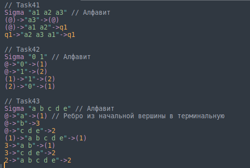

### Подсветить какие-нибудь особенности лексического синтаксиса в среде разработки. В отчете указать, что вы хотели подсветить и как.

Я использовала редактор `Sublime Text` на `Ubuntu`.
##### Как использовать:
- Взять файл `aigerimass.sublime-syntax` и перенести его в папку `/.config/sublime-text/Packages/User`
- В `Sublime Text` тыкнуть кнопку `View`, затем `Syntax`, затем выбрать `aigerimass`
- Теперь открытый файл будет подсвечен моей подсветкой

##### Как я создала свою подсветку синтаксиса:
- `Tools -> Packages -> Packages Development -> New Syntax Definition`
- Далее написала регулярные выражения для подсветки синтаксиса моего языка:
  - Ключевые слова в моем языке подсвечены стандартной подсветкой в `Sublime` ключевых слов языка `С`. Это: `Sigma`, `@`, `->`, `()`
  - Множество символов алфавита подсвечено в зеленый, как стандартная подсветка строк языка С
  - Имена состояний подсвечены оранжевым, как стандартная подсветка числовых констант языка С
  - Комментарии подсвечены серым

