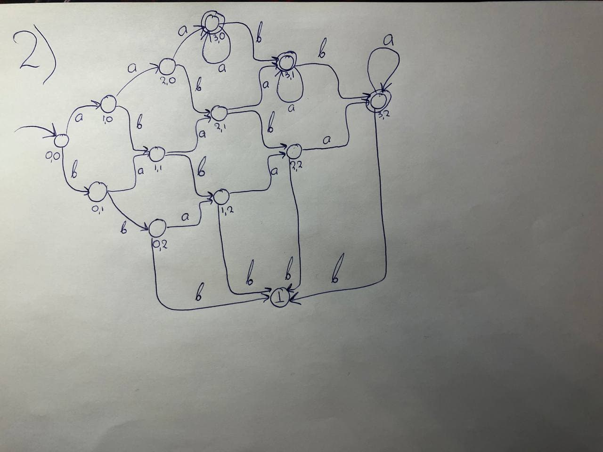

#### Константинов Степан
#### ДЗ 1

### Задача 1

Нужно просто проверить, является ли последний символ цифрой 0 или 5. Очевидно, автомат ниже именно это и проверит.


### Задача 2

Несложный автомат.




### Задача 3

Язык Go.

* Дженерики (которые вот-вот появятся).  
```go
func Min[T comparable](a, b T) T {
	if a < b {
		return a
	} else {
		return b
	}
}
```
Источник: https://go.googlesource.com/proposal/+/refs/heads/master/design/43651-type-parameters.md

* В Go нельзя переносить открывающую фигурную скобку на следующую строку:
```go
package main

import "fmt"

func main()  
{ // ошибка, так низя
    fmt.Println("Bad hello!")
}
```

А вот так можно:

```go
package main

import "fmt"

func main() {
    fmt.Println("Hello, world!")
}
```

Источник: https://golang.org/ref/spec#Blocks
