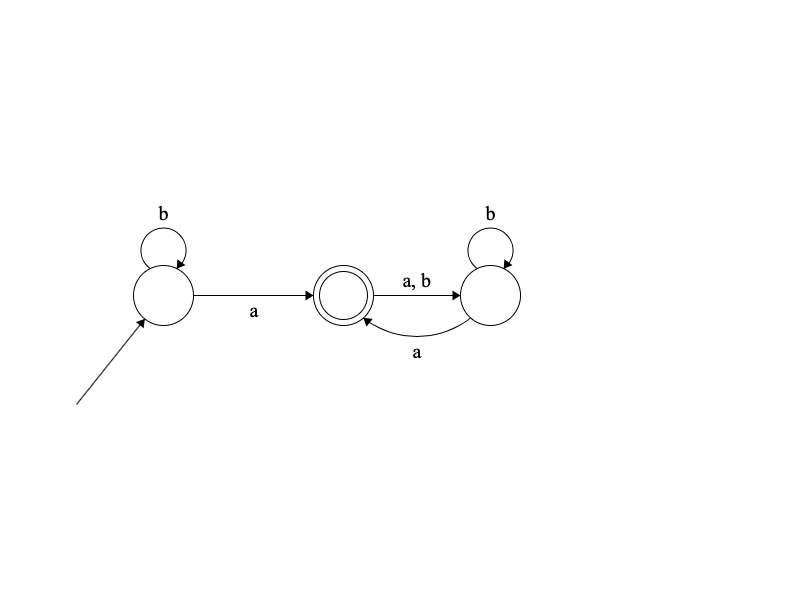

# HW02

1. Заметим, что для первой регулярки верен следующий автомат:

Это в свою очередь тоже, что и следующий автомат: 

Покажем, что все слова, которые распознает вторая регулярка, распознается этим автоматом; 
для этого нужно доказать, что после последовательности символов `(a | b)* b a `  мы всегда будем в правой вершине -- 
действительно, предпоследний символ `b` всегда оставит нас в левой вершиине, а по `a` перейдем в правую. 
Доказали, что язык первой регулярки включает в себя язык второй. 
<br>
Докажем теперь, что язык второй регулярки включает в себя первый, то есть все слова, которые распознает автомат выше, распознает и вторая регуляка.
Для этого заметим, что все последовательности, которые оставляют нас в левой вершине, могут быть описаны этим выражением `(a | b)*`;
далее заметим, что все переходы в правую вершину могут быть описаны `b a | a`, а все способы остаться в правой вершине могут быть описаны `(aa)*`. <br>
Таким образом показали, что язык второй регулярки включает в себя первый. <br>
Показали включение в обе стороны, значит два языка равны.

3. Для наглядного описания можно смотреть сразу в `kuksag_lexer/data*`. <br>
Чтобы пользователю было удобнее добавим ключевые слова: 
- `vertices`
- `edges`
- `from`
- `to`
- `edge`
- `start`
- `terminal`
- `sink`

Интересный момент состоит только в описании ребер -- значения на ребрах будем описывать внутри кавычек `"`. 
Возможность использовать кавычки в качестве ребра сохранена.
Чтобы использовать переносы строк, нужно явно указывать символ перевода строки `\n`, если вы хотите использовать рядом back-slash и n, то экранируйте back-slash (см. `data4.in` и `data4.in.out`) 


3. 
```shell
chmod +x ./kuksag_lexer/main.py
./kuksag_lexer/main.py --input data1.in --output data1.out
./kuksag_lexer/main.py --input data3.in
```
