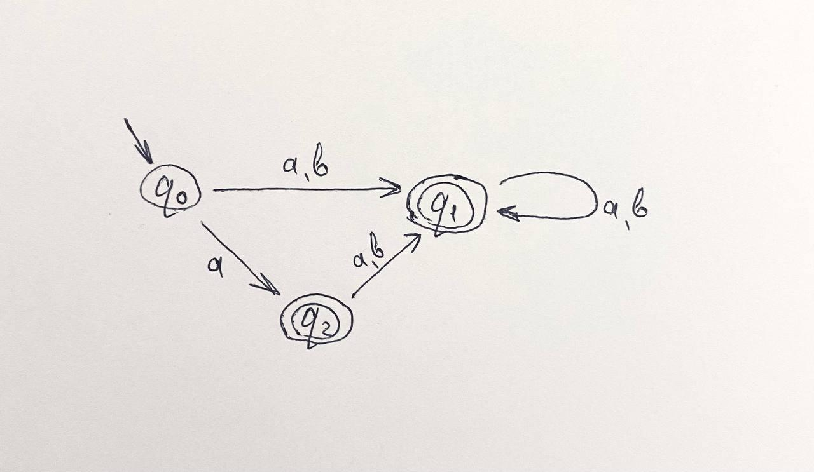
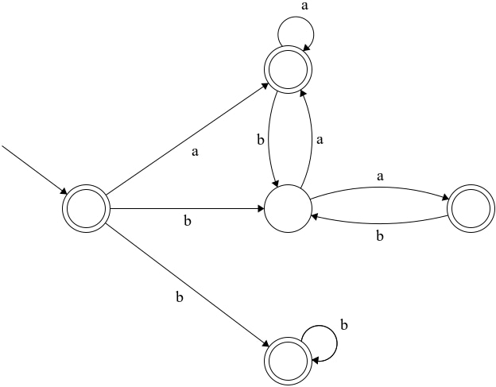

# Задача №1
Пункт 8__
Заметим, что самые короткие строки, которые вообще существуют - `''`, `a`, `b`. Заметим, что все они подходят под данное регулярное выражение (если пустая строка не считается, то `ba` тоже подходит - следующая по минимальности). `''` и `a` подходят под первую часть регулярки (то есть `(ba|a)*`), а `b` - под вторую (то есть `(bb|b)*`).__
Заметим, что `abbab` - не подходит, можно рассмотреть отдельно 2 части регуляри (левую и правую) и понять, что не подходит.
`bababa` - подходит. 3 раза нужно взять первую часть регулярки и 0 вторую.
# Задача №2
Пункт 1__
__
Подписанные вершины - последние символы строки.
Заметим, что у нас 6 варшин в автомате.
Докажем, что у нас не может быть меньше. Заметим, что у нас обязательно должны быть рассмотрены 4 варианты окончания строки (2 последних символа), ведь в разных случаях окончания будут разлиные исходы, одного символа на конце будет недостаточно, как минимум потому что, если на конце `0`, то строка может как подходить, так и не подходить. А если `1`, то если следующий символ `0`, то строка все равно будет подходить. Следовательно результат не меньше 4.__
Дальше нужно понять, что нужна ни одна из этих вершин не может быть вершиной старта, следовательно уже не меньше 5.__
Если у нас есть эти 5 вершин, то тогда строку `1` никак не обработать, следовательно их не меньше 6.
# Задача №3
Пункт 4__

# Задача №4
Пункт 1__

# Задача №5
Пункт 8__
__
Заметим, что у нас есть 3 варианта строк, подходящих под регулярное выражение:
1) пустая: `''`
2) строка только из букв `b`__
3) строка с любой последовательностью строк `ba` и `a`

Все эти варианты подходят под автомат, а другие варианты - нет.