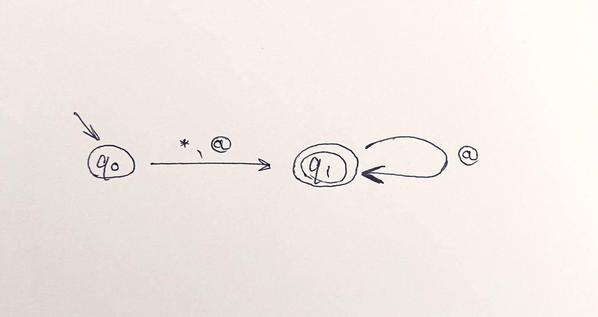

# Задание 0.    
Описание автомата:  
(Примеры можно найти во 2-3 задании)  
* Общие правила:
  + все числа оборачиваются в (..)
  + ключевые слова языка: alphabet, Q (количество состояний), start (начальное состояние), T (терминальные состояния), function (ребра с функцией перехода на них)
* Перечисляем алфавит языка автомата. Под капотом строим биекцию символов алфавита с натуральными числами. Например, если язык автомата {a,b}, то a -> 1, b -> 2. Далее 2 разделительных символа '||'.
* Номер вершины - стартового состояния
* Номера вершин - терминальных состояний
* Количество ребер, далее описание всех ребер автомата по принципу: (номер состояния - начала ребра)(номер состояния - конца ребра)(описание функции перехода по этому ребру). Описание функции перехода по ребру: мы строим биекцию между алфавитом языка автомата и натуральными числами и просто кодируем числами все символы языка автомата, по которым можно сделать переход в данном месте. Описание каждого ребра заканчивается символом "."  


# Задание 1.
Василевский Тимофей  
Примеры автоматов:  
```
Alphabet 01000100
Terminalvertexes 00110001
States 01000100
Startvertex 00110000
Edge 00110000 00110001 01000100
Edge 00110001 00110000 01000100

```  
```
Alphabet 01011110
Terminalvertexes 01011110
States 01010101
Startvertex 01011110
Edge 01011110 01011110 01011110

```  
Примеры некорректных вводов:  
Начальное состояние не единственно  
```
Alphabet 01000100
Terminalvertexes 00110001
States 01000100
Startvertex 00110000 00110001
Edge 00110000 00110001 01000100
Edge 00110001 00110000 01000100

```  
Символы алфавита не уникальны  
```
Alphabet 01011110 01011110
Terminalvertexes 01011110
States 01010101
Startvertex 01011110
Edge 01011110 01011110 01011110

```  
Общие комментарии: язык в целом очень удобный и хорошо описан. В синтаксический анализатор было бы неплохо добавить сообщения о том, какие именно проверки не прошел автомат.  
  

Громов Федор  
Примеры автоматов:  
```
{
036
}
{
048 049
}
{
048
}
{
049
}
{
048
036
049
049
036
049
}
```   
```
{
094
}
{
083
}
{
083
}
{
083
}
{
083
094
083
}
```   
Примеры некорректных вводов:  
Некорректный символ алфавита
```
{
-036
}
{
048 049
}
{
048
}
{
049
}
{
048
036
049
049
036
049
}

```  
Пропущены фигурные скобки в описании автомата  
```
{
094
}
083
{
083
}
{
083
}
{
083
094
083
}
```   
Общие комментарии: язык хороший, можно быстро и просто описывать на нем автоматы. В синтаксическом анализаторе, кажется, не хватает каких-нибудь проверок корректности автомата.


# Задание 2 и 3.
Искать в файлике `main.py`  
Запускать: `python main.py "input.txt"`  
Тесты:  
1)   
Ввод: `alphabet:01 ||Q:(2) start:(0) T:(1) function:(0)(1)(1)(2).(1)(1)(1)(2).`  
Вывод:  
```
Analyzing the machine...
Alphabet:
0 1 
Vertex count:
2
Start state: 
0
Terminal states: 
1 
Edges: 
transition from 0 to 1 by "01"
transition from 1 to 1 by "01"

Testing the machine...
PASSED: Alphabet elements are unique
RASSED: Initial state is the only one
PASSED: States are unique
PASSED: machine is deterministic
PASSED: machine is complete
Well done!

```  
2)   
Ввод: `alphabet:ab ||Q:(3) start:(0) T:(2)(1) function:(0)(1)(1)(2).(0)(2)(1).(2)(1)(1)(2).(1)(1)(1)(2).`  
Вывод:  
```
Analyzing the machine...
Alphabet:
a b 
Vertex count:
3
Start state: 
0
Terminal states: 
2 1 
Edges: 
transition from 0 to 1 by "ab"
transition from 0 to 2 by "a"
transition from 2 to 1 by "ab"
transition from 1 to 1 by "ab"

Testing the machine...
PASSED: Alphabet elements are unique
RASSED: Initial state is the only one
PASSED: States are unique
NOT PASSED: machine is not determenistic
PASSED: machine is complete

```  
3)   
Ввод: `alphabet:*@ ||Q:(2) start:(0) T:(1) function:(0)(1)(1)(2).(1)(1)(2).`  
Вывод:  
```
Analyzing the machine...
Alphabet:
* @ 
Vertex count:
2
Start state: 
0
Terminal states: 
1 
Edges: 
transition from 0 to 1 by "*@"
transition from 1 to 1 by "@"

Testing the machine...
PASSED: Alphabet elements are unique
RASSED: Initial state is the only one
PASSED: States are unique
PASSED: machine is deterministic
NOT PASSED: machine is not complete

```


