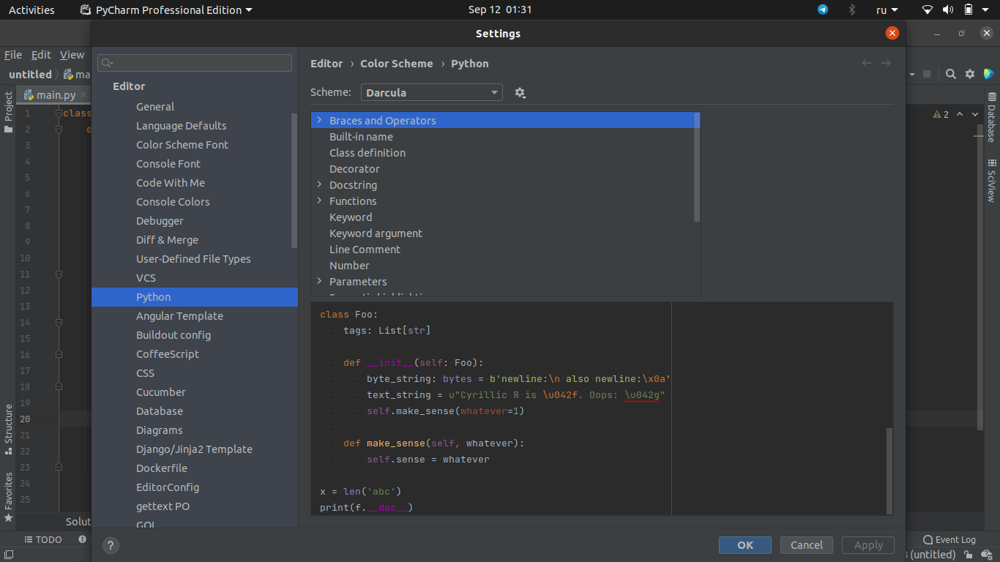
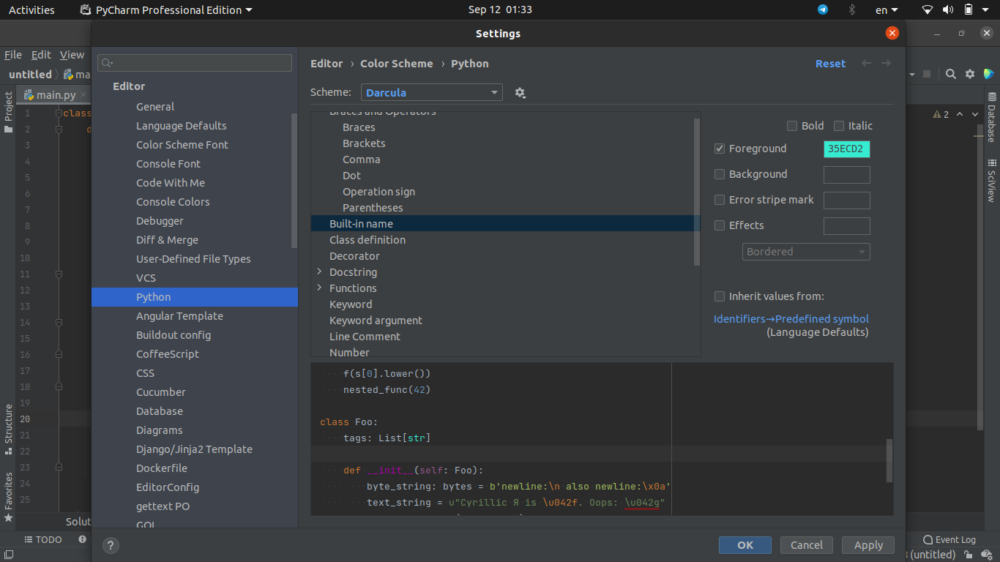
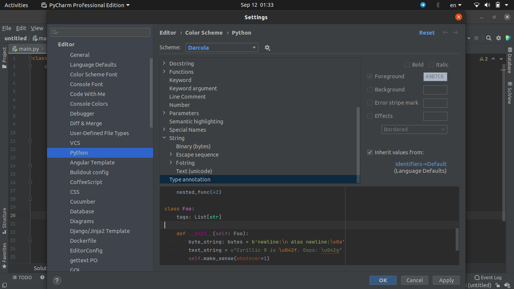
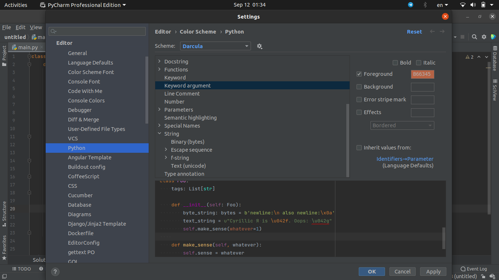
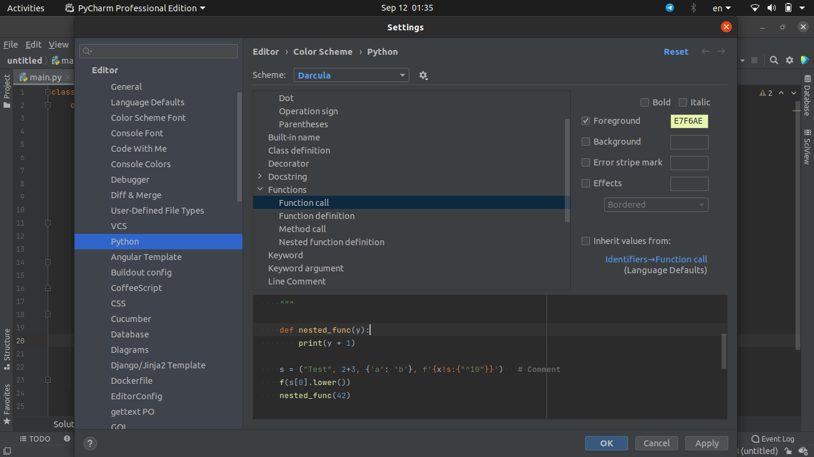

# Задача №1

# Задача №2

# Задача №3
Мой любимый язык программирование - Java, второй - Python, документация к которому есть [на сайте](https://docs.python.org/).
Иснересно было посмотреть, какие фичи будут в новой версии: `Python 3.9.7`. Это можно посмотреть [тут](https://docs.python.org/3/whatsnew/3.9.html).
## Dictionary Merge
Первое, что я заметил, это - добвление нового опратора для словарей: `Megre (|)`. Он позволяет сливать 2 словаря в один, есть пример на сайте:
```python
>>> x = {"key1": "value1 from x", "key2": "value2 from x"}
>>> y = {"key2": "value2 from y", "key3": "value3 from y"}
>>> x | y
{'key1': 'value1 from x', 'key2': 'value2 from y', 'key3': 'value3 from y'}
>>> y | x
{'key2': 'value2 from x', 'key3': 'value3 from y', 'key1': 'value1 from x'}
```
## String Methods to Remove Prefixes and Suffixes
Также в новой версии есть новый функии, связанные со строками: [`str.removeprefix`](https://docs.python.org/3/library/stdtypes.html#str.removeprefix) и [`str.removesuffix`](https://docs.python.org/3/library/stdtypes.html#str.removesuffix). Они позволяют удалять суффикс или префикс строки.
```python
>>> 'TestHook'.removeprefix('Test')
'Hook'
>>> 'BaseTestCase'.removeprefix('Test')
'BaseTestCase'
>>> 'MiscTests'.removesuffix('Tests')
'Misc'
>>> 'TmpDirMixin'.removesuffix('Tests')
'TmpDirMixin'
```
# Задача №4
## Описание
Пусть `S` - алфавит для описания языка, на котором задается названия ребер и вершин в автомате (пояснения к автомату, может быть его номер). Назовем его `L`. Возьмем какие-нибудь 4 символа: `A`, `B`, `C`, `D`; которых нет в `S` (они есть, так как алфавит конечен). 
Дальше нужно научиться записывать слова: "вершинa", "ребро" и "автомат".
Параметра у вершины: является ли она терминальной и ее описание. Будем делать так: для начала оборачивать слово в буквы `A`, внутри первым символом будет `0` или `1` - в зависимости от терминальности, и дальше описание на языке `L`, обернутое в `B`.
Для слова ребро будем оборачивать его в `C`, внутри записать исходящую вершину, затем описание ребра, обернутое в `B`, а потом входящую.
И теперь осталось описать слово автомат: обернем в символы `D`, а внутри - отсортированный список ребер.
Таким образов, у нас каждый автомат описывается единственным образом, а слово не может относится к более чем 1 автомату.
## Примеры

1) `DCBBA0B1BACCA0B1BABabcBA1B2BACCA1B2BAB2BA1B2BACD`
2) `DCBBA0B1BACCA0B1BAB1BA0B2BACCA0B1BAB0BA1B3BACCA0B2BAB0BA1B3BACCA1B3BAB1BA0B2BACCA1B3BACB0BA1B3BAD`
3) `DCBBA0B1BACCA0B1BAB1BA0B1BACCA0B1BAB0BA0B2BACCA0B2BAB0BA0B3BACCA0B3BAB0BA1B4BACCA1B4BAB1BA0B1BACCA0B3BAB1BA0B1BACCA0B2BAB1BA0B1BACD`
# Задача №5
Я продолжу приводить примеры из языка программирования `Python`. У `Python` есть среда разработки `PyCharm`, в котором есть некая раскраска по умолчанию, к которой у меня есть некоторые вопросы.
`PyCharm` предлагает возможность пользователю настроить самому, перейдя `Settings-Editor-Color Scheme-PyCharm`:

Во-первых, хочется цвет типов переменных отличать от цветов таких некоторых встроенных методов, как `len`. Для этого можно перекрасить типы переменных в лазурный:

Также хочется как-то выделить название класса. Логично это сделать розовым цветом, как `__item__` и `self`, ведь они тесно связаны с классом:

То, что меня напрягло, когад я это увидел в первый раз - это довольно яркая красная подсветка. Легко спутать с обозначением какой-нибудь ошибки. Поэтому, стоит это подправить и сделать цвет более светлым:

Еще можно сделать различие между вызовом функий и обозначением переменных:

