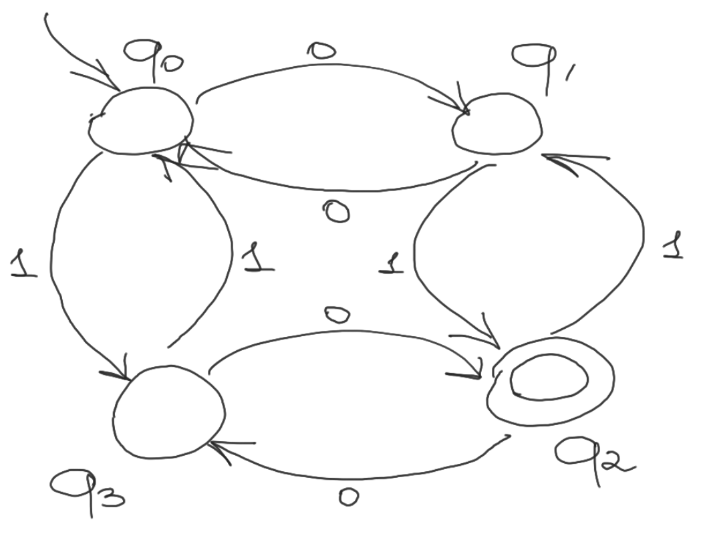
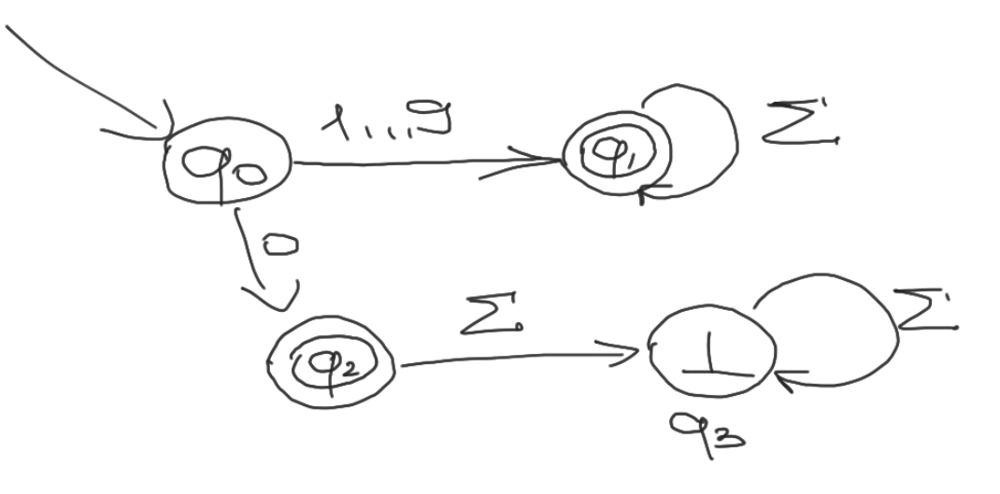
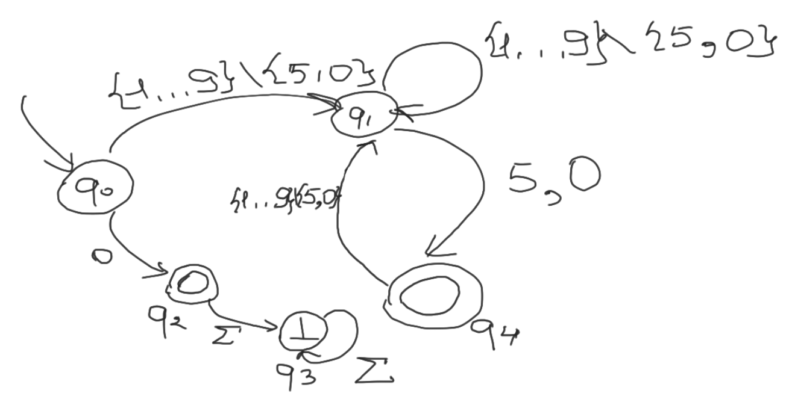

# Язык для описания конечных автоматов

Будем отталкиваться от определения ДКА: 

A = $(\sum, Q, q_0, T, \delta)$

Последовательно зададим каждый из элементов, чтобы получить однозначное описание автомата:

1. В первой строке перечислим через запятую все символы алфавита.

2. Во сторой строке зададим количество состояний в множестве $Q$

3. На третьей строке расположим номер начального состояния $q_0$

4. В четвёртой строке перечеслим через запятую множество терминальных вершин (числа от 0 до $|Q|-1$, соответствующие номерам терминальных состояний).

5. На каждой из последующих строк зададим функцию перехода в формате: 

    $q_{a_1}: \{\alpha_1, \alpha_2, \dots\} \rightarrow q_{b_1}, \{\beta_1, \beta_2, \dots\} \rightarrow q_{b_2}, \{\gamma_1, \gamma_2, \dots \} \rightarrow q_{b_3} \dots$

    Где $q_{a_1}$ - номер состояния, из которой происходит переход, $\{\alpha_1, \alpha_2, \dots\}, \{\beta_1, \beta_2, \dots\}, \{\gamma_1, \gamma_2, \dots \}, \dots$ - множества символов, по которым происходит переход между определённой парой вершин ("рёбра" автомата), $q_{b_1}, q_{b_2}, \dots$ - номер состояния, куда происходит переход. 

## Примеры

1.  * Автомат, определяющий принадлежность битовой строки к языку битовых строк с нечётным количеством нулей и нечётным количестве единиц.

        

    * Описание автомата: 
    
        $
        0,1 \\
        4 \\
        0 \\
        2 \\
        0: \{0\} \rightarrow 1, \{1\} \rightarrow 3 \\
        1: \{0\} \rightarrow 0, \{1\} \rightarrow 2 \\
        2: \{0\} \rightarrow 3, \{1\} \rightarrow 1 \\
        3: \{0\} \rightarrow 2, \{1\} \rightarrow 0
        $

2. * Автомат, распознающий язык неотрицательных чисел без лидирующих нулей.

        

    * Описание автомата:

    $
    0,1,2,3,4,5,6,7,8,9 \\
    4 \\
    0 \\
    1,2 \\
    0: \{0\} \rightarrow 2, \{1,2,3,4,5,6,7,8,9\} \rightarrow 1 \\
    1: \{0,1,3,3,4,5,6,7,8,9\} \rightarrow 1 \\
    2: \{0,1,2,3,4,5,6,7,8,9\} \rightarrow 3 \\
    3: \{0,1,2,3,4,5,6,7,8,9\} \rightarrow 3
    $

3. * Автомат, распознающий язык неотрицательных чисел без лидирующих нулей, делящихся на 5.

        

    * Описание алгоритма:

    $
    0,1,2,3,4,5,6,7,8,9 \\
    5 \\
    0 \\
    2, 4 \\
    0: \{1,2,3,4,6,7,8,9\} \rightarrow 1, \{0\} \rightarrow 2 \\
    1: \{1,2,3,4,6,7,8,9\} \rightarrow 1, \{5,0\} \rightarrow 4 \\
    2: \{0,1,2,3,4,5,6,7,8,9\} \rightarrow 3 \\
    3: \{0,1,2,3,4,5,6,7,8,9\} \rightarrow 3 \\
    4: \{1,2,3,4,6,7,8,9\} \rightarrow 1
    $

