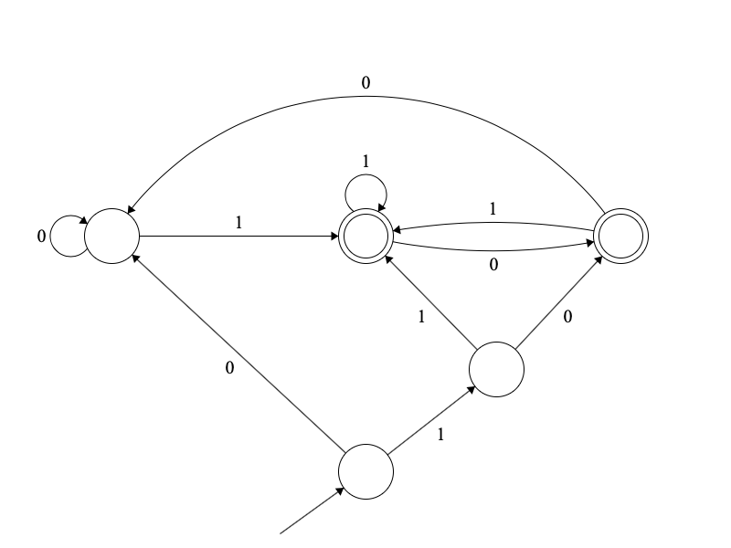
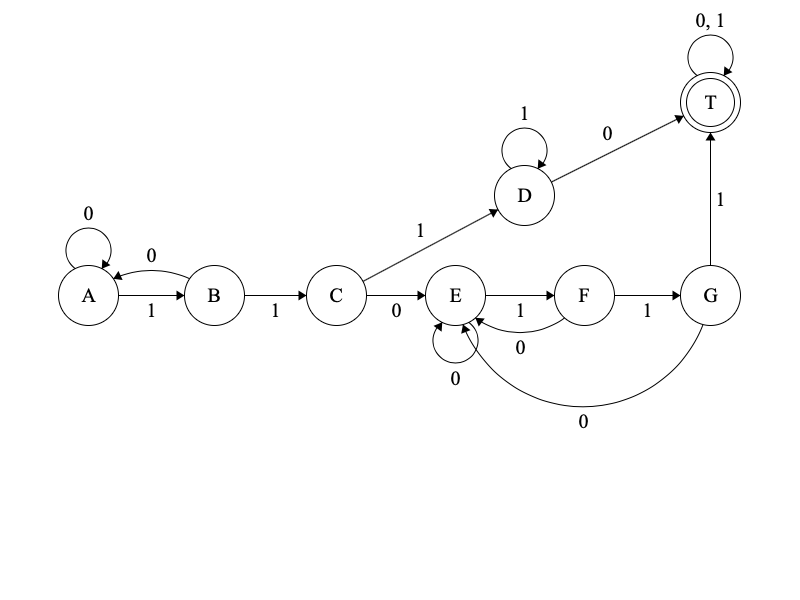
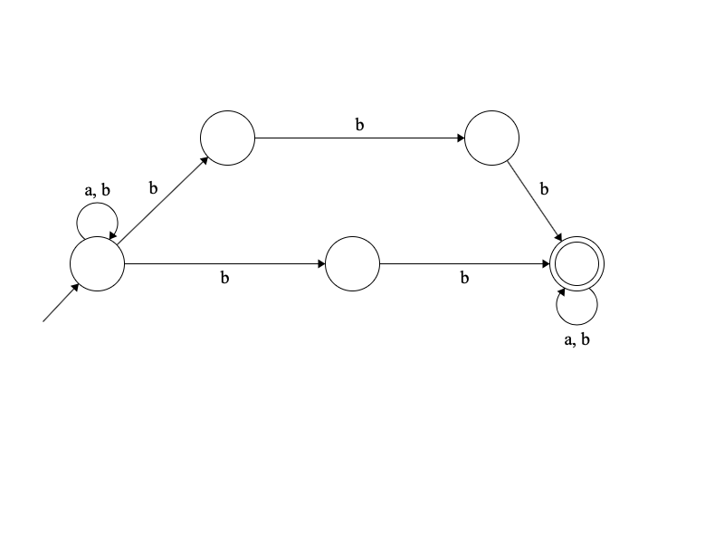

# HW 03

Номер в списке -- 13.

1. №13  
- bb
- bba
- bbb  
abbab принадлежит; bababa не принадлежит, так как все слова, распознаваемые языком, содержат две `b` подряд
2.  

3. №13  
Данному языку соответствует такой автомат: 
 
И ему соответствует такая грамматика:  
A -> 0A|1B  
B -> 0A|1C  
C -> 0E|1D  
D -> 0T|1D  
T -> 0T|1T|\eps  
E -> 0E|1F  
F -> 0E|1G  
G -> 0E|1T
4. №6   
Рассмотрим самую правую букву `a` и выберем в качестве `\alpha` все, что стоит до нее, и `\betta` все,
что стоит после нее -- заметим, что мы получили верное разбиение, так как `\betta` содержит 0 букв `a`;  
осталось гарантировать, что есть хотя бы одна буква `a` и в `\alpha` есть буквы `b` в количестве > 0:
`(a|b)* b a b*`
5. №13

